```mermaid
---
Hardware of Computer Organization 
---
flowchart TB
    subgraph LG[逻辑门]
        direction LR
        Boo(Boolean Logic)
        subgraph Tran[Transistor]
            direction LR
            Ele(Electrodes - output)
            Cont(Control wire - input)
        click Ele href "#transistor" "跳转"
        click Cont href "#transistor" "跳转"
        end
        Boo & Tran -->|consist|Gate
        NOT(NOT)
        AND(AND)
        OR(OR)
        XOR(XOR)
        Gate(Logic Gate)
        Gate --o|contains|NOT & AND & OR & XOR 
        click NOT href "#not-gate" "跳转"
        click AND href "#and-gate" "跳转"
        click OR href "#or-gate" "跳转"
        click XOR href "#xor-gate" "跳转"
        click Gate href "#logic-gate" "跳转"
    end
    subgraph Binary[二进制]
    direction LR
    Bi(binary) --o|represents|Float(float) & Num(num) & ASCII(characters<br> ASCII) & Unic(all languages<br> 16-bit Unicode) & BiOthers(symbols, sounds<br> colors, graphics etc.)
    click Bi href "#binary" "跳转"
    click float href "#float" "跳转"
    click ASCII href "#ascii" "跳转"
    end
    subgraph ALU[算数逻辑单元]
        direction TB
        subgraph AU[Arithmetic Unit]
            HAdder(Half Adder)
            FAdder(Full Adder)
            aluOthers(Others:<br>减法, 错位减法<br>负, 增量+1<br>减量-1, 无改变)
            click HAdder href "#half-adder" "跳转"
            click FAdder href "#full-adder" "跳转"
            click AU href "#arithmetic-unit" "跳转"
        end
        subgraph LU[Logic Unit]
            LUZero(Zero)
            Overf(Overflow)
            Negative(Negative)
            click LUZero href "#logic-unit" "跳转"
        end
        ALUInputA[Input A<br>8 bits]
        ALUInputB[Input B<br>8 bits]
        subgraph ALUOperation[Operations]
            direction TB
            ALUOPCode(Operation Code<br>4 bits)
            ALUInstructions(Instructions)
            ALUOPCode -->|correspond|ALUInstructions
            click ALUOPCode href "#alu-operation-code" "跳转"
        end
        subgraph ALUOutput[Output]
            ALUOutputValue[Output Value<br>8 bits]
            ALUFlags(Flags<br>1 bits)
        end
        AU --o ALUOPCode
        LU --o ALUFlags
        ALUInputA & ALUInputB --> ALUOperation ---> ALUOutput
        click ALUFlags href "#alu-flags" "跳转"
    end
    subgraph Memory[Memomy]
        direction TB
        subgraph Latch
            direction LR
            LatchNode(Latch)
            subgraph LatchAttr[Latch Attr]
                direction TB
                LatSet(set)
                LatReset(reset) 
                LatSet ~~~ LatReset
            end
            LatchNode --o|wire|LatchAttr
        end
        subgraph GatedLatch
            direction LR
            GLatchNode(Latch Node)
            subgraph GLatchAttr[GLatch Attr]
                direction TB
                GLInput(input)
                GLWriteEnable(write enable) 
                GLInput ~~~ GLWriteEnable
            end
            GLatchNode --o|wire|GLatchAttr
        end
        subgraph Register
            direction LR
            RegisterNode(register)
            subgraph RegAttr
                direction TB
                RegInput(data-input)
                RegRead(read)
                RegWrite(write)
            end
        end
        subgraph Reg256[256-bit memory]
            direction LR
            Reg256Node(256-bit Register) --o Multiplexer[multiplexer]
        end
        click Multiplexer href "#multiplexer" "跳转"
        click Reg256Node href "#256-bit-register" "跳转"
        Register --o|in a grid|Reg256
        Register --o|in a row|Reg8(8-bit Register) 
        Latch --->|improve|GatedLatch ----|arrange<br>side-by-sidy|Register
        RegisterNode --o|wire|RegAttr
        RegInput ~~~ RegRead ~~~ RegWrite
        Reg256 --->|8 in a row|RAM256(RAM of 256<br>8-bit address)
        click RegisterNode href "#register" "跳转"
        click LatchNode href "#latch" "跳转"
        click GLatchNode href "#gated-latch" "跳转"
        click Reg8 href "#8-bit-register" "跳转"
        click RAM256 href "#ram" "跳转"
    end
    Binary ---->|method|ALU
    LG ---->|build|ALU
    LG ---->|build|Memory
    subgraph CPU[CPU]
    direction TB
        CPUUnit((CPU))
        AdCPU((Advanced CPU))
        CPUUnit --- AdCPU
        subgraph Phases
        direction TB
            Fetch[①Fetch]
            Decode[②Decode]
            Execute[③Execute]
            Fetch --> Decode --> Execute
            Execute -->|Cycle|Fetch
        end
        Phases -.-|1 Clock/Each Step|Clock[Clock<br>Link and Send Signals to CU<br>keep things in lock-step]
        click Clock href "#clock" "跳转"
        click AdCPU href "#advanced-cpu-designs" "跳转"
        
        subgraph CPUFlow[flow]
            direction LR
            IAReg(Instruction Address Register)
            InsTable(Instruction Table)
            CU(Control Unit)
            subgraph IReg[Instruction Register]
                direction TB
                OptCode(Operation Code)
                OptAddr(Operating Addr<br>memory or registers)
            end
            cpuALU(ALU)
            Registers(Registers)
            OptCode -.-|②Decode: Operation Code Ref|InsTable
            CU --o|③Execute: Enable wire|Registers
            cpuALU -->|③Execute: Output<br>Flags:O Z N|CU
            CU -->|③Execute: inputA & inputB<br> Operation Code|cpuALU
            CU -->|Complete<br>Increment Address by 1|IAReg
        click IAReg href "#instruction-address-register" "跳转"
        click InsTable href "#instruction-table" "跳转"
        click CU href "#control-unit" "跳转"
        click OptCode href "#instruction" "跳转"
        click Registers href "#cpu-registers" "跳转"
        end
    click CPUUnit href "#cpu" "跳转"
    end
    IAReg --->|①Fetch: Input Address<br>寻址|RAM
    RAM --->|①Fetch: Output Data<br>写入|IReg
    RAM -->|③Execute:Data Wire|Registers
    CU --o|③Execute: Enable wire|RAM
    IReg --->|②Decode: Activate <br>the Specify Instruction Circuit|CU
    Memory ----> RAM
    ALU ----->|build|CPU
```

### Transistor
>Def: Electrically controlled switches.  
{: .prompt-tip }
>Picture of Transistor:  
 

### Logic Gate
>Def: Operations that implement boolean logic in circuit level.
{: .prompt-tip }
#### Not Gate

#### And Gate

#### Or Gate

#### XOR Gate

### Binary
>def: A math method representing more information through two values. Each digit'multiplier is two times larger than the one to the right.
{: .prompt-tip }  
example:   
  
addtion rule:   

#### Float

#### ASCII
>def: 7-bit code. contains: punctuation, digits, letters.  
limit: Only designed for english.  
{: .prompt-tip }

### ALU
>def: A unit for computation, consisting of two unit - an arithmetic unit and a logic unit.
{: .prompt-tip }

#### Arithmetic Unit
>def: Handling all numerical operations in a computer, like addition, subtraction and increment operation. Processing data bit by bit.  
{: .prompt-tip }

##### Half Adder
>Two input and two output.
{: .prompt-tip }

>The course of build a half adder.

##### Full Adder
>Three input and two output. Able to manage the addition of next column.

##### 8-Bit Ripple Carry Adder
>built by half adder and full adder

#### Logic Unit
>It performs simple numerical tests, like checking if a number satisfies certain condition.
{: .prompt-tip }
Example:  
zero: check if the number is zero.

#### ALU Operation Code
>def: In this case, it uses 4 bits.  
For example 1000 might be the command to add, while 1100 is the command for subtract.
{: .prompt-tip }

#### ALU Flags
>def: 1-bit outputs for particular states and statuses.  
For example, 1 - 1 = 0 sets the Zero Flag to True(1).
{: .prompt-tip }

### Memory
>def: The part of a computer in which information or programs are stored either permanently or temporarily, or the amount of space available on it for storing information.
Type1. RAM: Random Access Memory.   Which stores things like game state - as long as the power stays on.  
Type2. Persistent Memory: It can survive without power.
{: .prompt-tip }

#### Latch
>def: built by logic gate and used to store one bit of information.  
This is called a "latch" because it "latches onto" a particular value and stays that way. The action of putting data into memory is called writing, whereas getting the data out is called reading.  

#### Gated Latch

#### Register
>def: A group a latches operating side-by-side is called a register, which holds a single number, and the number of bits in a register is called its width.  
functions required:  
* input [data for write]
* read [data stored]
* write [enable write the data in input]

{: .prompt-tip }

##### 8-bit Register
Arrangement: n-bit put n latches in a row  
* data wire - n
* output wire - n
* enable wire - 1
* in total: 2n + 1

|       wire        | num  |     mem      |
| ----------------- | ---- | ------------ |
| data wire         | n    | input data   |
| output wire       | n    | read         |
| write enable wire | 1    | enable write |
| in total          | 2n+1 |              |

##### 256-bit Register
Arrangement: Use matrix, put latches in an n x m grid.  
>specify certain latches by row wire and column wire then it comes to the previous pattern.  
{: .prompt-tip }
- row wire - n
- column wire - m
- write enale wire - 1
- read enale wire - 1
- data wire - 1
- in total n+m+3

|       wire       |  num  |    mem     |
| ---------------- | ----- | --------- |
| row wire          | n     |           |
| column wire       | m     |           |
| write enable wire | 1     | write      |
| read enable wire  | 1     | output     |
| data wire         | 1     | input data |
| in total          | n+m+3 |           |

16x16 Latch Matrix  
  
  
Picture of the latch at the intersection of the two active wires  
  

###### Multiplexer
> Multiplexer(多路复用器): convert from an address into something that selects the right row or column.  
Things like 1000 0010, means row 8 and column 2.  

#### RAM
>An important property: We can access any memory location, at any time, and in a random order.  
For this, it's called Random-Access Memory or RAM.  
{: .prompt-tip }
>Picture of 256-bit of Memory    

  
>Put 8 256-bit Memory in a row so that store an 8-bit number as a byte.  
When it comes to store address, each memory stores one bit on the same address, there's 8 memory to store so it is an 8-bit number.  
This is a SRAM(Static Random-Access Memory) which uses latches.  
Other types of RAM, such as DRAM, Flash memory, and NVRAM. They use different circuits to store the individual bits. For example, using different logic gates, capacitors, charge traps, or memristors.
{: .prompt-tip }

>Think of it as a uniform bank of addressable memory. It have 256 addresses, and at each address we can read or write an 8-bit value.  

### CPU
>def: The Central Processing Unit.
{: .prompt-tip }

Simplified CPU:  
    

Intel 4004 CPU  
  

#### CPU-Registers
>def: Thery are used to temporarily store and manipulate values.  
* When we first boot up our computer, all of registers start at 0.  

##### Instruction Address Register
>def: A register to keep track of where we are in a program, stores the memory address of the current instruction.  

##### Instruction Register
>def: A register to store the current instruction.  
At this hypothetical example, the instruction stored is an 4 bits opcode in register.

#### Control Unit
>def: Like everything else we've built, it too is made out of logic gates.  
Different instructions are decoded by different logic circuits, which configure the CPU's components to perform that action.  
Also, the Control Unit has internal registers to temporarily save the output from ALU, in case of the new value would ripple back into the ALU and then keep doing the action to itself. After turning  off the ALU, then write the value into the destination register.

Example:  Check if Load_A Instruction  
  

  

#### Clock
>def: Transition the CPU through its fetch, decode and execute phases. Take the responsibility of keeping the CPU ticking along.  
The clock triggers an electrical signal at a precise and regular interval. The sinal is used by the Control Unit to advance the internal operation of CPU, keeping everything in lock-step.  
The speed at which a CPU can carry out eacho step of fetch-decode-execute cycle is called its <mark>Clock Speed</mark>. This speed is measured in <mark>Hertz</mark> - a unit of frequency. <u>One Hertz means one cycle per second.</u>
{: .prompt-tip }

##### Overclocking
Modify the clock to speed up the tempo of the CPU. Chip makers often design CPUs with enough tolerance to handle a little bit of overclocking.  
  

##### Underclocking
Application: Sometimes it's not necessary to run the processor at full speed. By slowing the CPU down, it can save a lot of power.  

##### Dynamic Frequency scaling
动态调整频率  
Processors can increase or decrease their clock speed based on demand.  

### Instruction
Strategies to have bigger instructions:  
- The Instruction Length: with more bits, like 32 or 64 bits.  
- Variable Length Instructions
    - Execute Immediately: see an instruction that needs no extra values
    - Immediate Value: saved immediately behind the instruction that needs value in memory.
    
#### Instruction Table
>def: Assign an ID to each instruction supported by CPU. The ID is called "operation code" or opcode for short.  

Hypothetical Example:  
> We use the first four bits to store the "operation code".  And the last 4 bits specify where the data for that operation should come from - this could be register or an address in memory.  

Basic Instruction:  

  
  
Real Instruction Example:  

#### Instruction Execute View
Origin View:  
    
    
Easy-Understand View:  

#### Advanced CPU Designs
>Boost performance allowing not only simple instructions to run fast, but also performing much more sophisticated operations.
{: .prompt-tip }
The ways to Advance CPU:  
* Improve the speed of switching transistors
* Design specific circuit to complete sophisticated operation, like divide, game and video codec.
    * makes the ALU bigger and more complicated to design.
* [Cache](#cache)Add cache to enhance the speed of data-input or output.
    * [Dirty bit ](#dirty-bit)
* Instruction Pipelining
    * Parallelize
    * Out-of-order execution
    * Jump instructions
    * speculative execution
    * branch prediction
* [Superscalar Processor](#superscalar-processor)
    * Execute more than one instruction per clock cycle.
    * More ALU
* [Multi-core processor](#multi-core-processor)
* More CPU

##### Cache
>Scenario: A "load from RAM" instruction might take dozens of clock cycles to complete, and during this time the CPU processor is just sitting there idly waiting for the data. One solution is to put a little piece of RAM right on the CPU -- called a cache.  
Function: Allows the RAM transmit a whole block of data to CPU and saves it into cache.  
{: .prompt-tip }
  
* Cache Hit
    * Data requested in RAM is already stored in the cache.
* Cache Miss
    * Data requested isn't in the cache, you have to go to RAM.

##### Dirty Bit
>def: A special flag of cache for each block of memory it stores. Record the mismatch between the cache's copy of the data and the real version stored in RAM, so that everything can get synced up later.  
{: .prompt-tip }

  

Most often the synchronization happens when the cache is full but a new block of memory is being requested by the processor.

##### Instruction Pipelining

  

When parallelizing pipelining, this can lead to some tricky problems:    
Num.1  
* Dependency in the instructions.
    * For example, fetch someting that the currently executing instruction is just about to modify.  
Solution:   
* Out-of-order execution
    * Dynamically reorder instructions with dependencies, in order to minimize stalls and keep the pipeline moving.

Num.2  
* Jump Instructions
    * Change the execution flow of a program depending on a value. 
    * A simple pipelined processor perform a long stall when it sees a jump instruction, waiting for the value to be finalized.  
Solutions:   
* Speculative execution
    * Imagine an upcoming jump instruction as a fork in a road - a branch. Advanced CPUs Guess which way they are going to go and filling their pipeline with instructions based off that guess
    * If the CPU guessed wrong, is has to discard all its Speculative results and perform a <u>pipeline flush</u>
* Branch Prediction
    * Sophisticated ways to guess which way branches will go, the accuracy of which is often over **90%**.
    
##### Superscalar Processor
With more ALUs so it can execute many mathematical instructions all in parallel:  

##### Multi-core Processor
>Like dual core or quad core processors. This means there are multiple independent processing units inside of a single CPU chip.  
Like having multiple separate CPUs, but for they're tightly integrated, they can share some resources, like cache, allowing the cores to work together on shared computations.  

