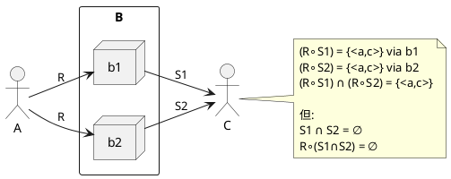

  
  
## 思维导图

### 命题与范式
  
  

  
  
#### 1\. 一切的开始：从“砖头”到“句子”

*   **命题变元 (Propositional Variable)**：这就是最最基础的“原子”或者说“砖头”，比如 `p`、`q`。它本身代表一个非真即假的简单陈述。
*   **文字 (Literal)**：这个概念很重要。你给的词里有“短语”，但在标准逻辑里，我们通常叫它“文字”。它就是一个变元或者这个变元的“否定”，比如 `p` 和 `¬p`。你可以把它想象成带正电（p）和带负电（¬p）的砖头，比单个的砖头多了一点信息。
*   **命-题公式 (Propositional Formula)**：把这些“文字”用“合取 (∧, AND)”和“析取 (∨, OR)”这些逻辑胶水粘起来，就成了一个完整的“句子”，也就是命题公式。它是我们整个故事的主角。

#### 2\. 分析主角的工具：真值表

*   **真值表技术 (Truth Table)**：这玩意儿就是个“照妖镜”。无论一个公式多复杂，把它扔进真值表，它在所有可能性（所有变元的真假组合）下的结果是真是假，都一目了然。这是我们后面所有操作的基础。

#### 3\. 两条主线：析取范式 (DNF) 与 合取范式 (CNF)

现在，故事分成两条线了，就像一个公式可以有两种不同的“标准照”。

**路线一：析取范式（DNF）—— 找“真”**

*   **极小项 (Minterm)**：你看真值表里，那些让整个公式结果为 **真 (True)** 的行。每一行都对应一个“极小项”。极小项是个“合取”式，包含了所有变量，并且能精确匹配那一行的真假赋值。比如 `(p=0, q=1)` 对应的极小项就是 `¬p ∧ q`。它就像是某个案件中，能让“真相大白”的唯一一种关键线索组合。
*   **主析取范式 (PDNF)**：把所有能让公式为“真”的极小项，用“析取 (∨)”连起来，就成了主析取范式。因为它是由所有“真”的情况构成的，所以它和原公式是等价的。这是公式的第一个“标准身份证”，全球唯一。
*   **析取范式 (DNF)**：PDNF是一种要求很严格的DNF。普通的DNF没那么严格，只要整体结构是“合取式的析取”，比如 `(p) ∨ (¬p ∧ q)`，就算。

**路线二：合取范式（CNF）—— 排除“假”**

*   **子句 (Clause)**：这是CNF的基本单元，它本身是一个“析取”式，比如 `(p ∨ ¬q)`。
*   **极大项 (Maxterm)**：对应地，你看真值表里那些让公式结果为 **假 (False)** 的行。每一行都对应一个“极大项”。极大项是个“析取”式，它也包含了所有变量，并且它的值在那一行恰好为假。比如 `(p=0, q=1)` 对应的极大项是 `p ∨ ¬q`。它就像是案件中，必须被排除的一种“错误可能性”。
*   **主合取范式 (PCNF)**：把所有能让公式为“假”的极大项，用“合取 (∧)”连起来，就成了主合取范式。它的逻辑是“不能是这种情况，**并且**也不能是那种情况……”，通过排除所有错误，剩下的自然就是正确的。这是公式的第二个“标准身份证”，同样全球唯一。
*   **合取范式 (CNF)**：PCNF是严格版的CNF。普通的CNF只要结构是“析取式的合取”（也就是一堆子句的合取）就行。

#### 4\. 补充说明

*   **编码 (Encoding)**：这很好理解。就是给变元的真假赋值（比如 p=T, q=F）一个二进制编号（10）。这个编号 `i` 正好对应极小项 `mᵢ` 和极大项 `Mᵢ` 的下标，让找它们变得非常方便。
*   **总结一下**：任何一个命题公式，都能被唯一地表示成它的主析取范式（所有“真”的可能性的总和）和主合取范式（排除所有“假”的可能性的结果）。而真值表，就是找到这些“真”和“假”的可能性的核心方法。


---
## 命题

### 联结词

#### 优先级
$$\lnot\ >\ \land\ >\ \lor\ >\ \to\ >\ \leftrightarrow$$


  
### 基本等价关系

  
  

  
  
  
  
#### 逻辑电路简化
> 并联：$\lor$  
串联：$\land$

$$(\lnot G\lor H)\land(\lnot H\lor G)$$
 --- 
  
## 公式
  
  
### 个体词、谓词与量词  
  
#### 引入

  
  
  
  
### 表示
  
#### 个体词


#### 谓词
  
  
   
--- 
>命题可以表示成0元谓词，但 0元谓词 不等于 命题，当0元谓词中的谓词为谓词常量时，才成为命题。
{: .prompt-tip }

  
  
---  
  
#### 量词
  
  
    

  
##### 符号化


  
  
#### 规则

  
  
### 谓词公式
#### 解释


  
  
#### 分类

  
#### 可判定性

  
  

#### 公式等价


  
### 前束范式
#### 求解步骤

  
#### 求解示例

  
  
### 推理
    
#### 推理定律-基本蕴含关系


  

  
  
#### 推理规则-量词消去与添加 US|UG|ES|EG
##### 全称特指规则-消去

    
##### 全称推广规则-添加

  
##### 存在特指规则-消去  

  
##### 存在推广规则-添加  

  
  
  
#### 谓词综合推理
  
xx是xx，符号化时，全称量词用 蕴含$\rightarrow$，存在量词用 合取$\land$  
  

  

##### 谓词演绎举例  
  
  
  
##### 实例代入的顺序  
  
  
错误的推导：  

  


##### 反证法  

  
  
##### 应用  
    
  
  
  


  
  
  
  
  
## 关系理论
  
### 序偶与笛卡儿积  
  
#### 序偶（有序组）

  
---
    
#### 笛卡儿积定义

  
  
  
#### 笛卡儿积性质  

  
  
* 不满足 结合律、交换律
* 对交、并运算，满足分配律
  
#### 笛卡儿积推广  

  
  
---
  
  
### 二元关系  
  
---
#### 二元关系定义  
  
  
  
  
  
  
  
  
---
> 所有的多元关系都可以写成二元关系
{: .prompt-tip }  


  
---
#### 二元关系符号表示

  
#### 集合表示（枚举与叙述）  
  


#### 关系枚举

  
  
---  
#### 图形表示  
  
  
  
  
  
---  
  
  
#### 关系矩阵表示  
  
  
  
  
#### 布尔矩阵的运算  

##### 并和交运算
  
  
  
  
  

  
  
  
##### 积运算

  
  
  
  
  

  
---
#### 定义域与值域  
  

  
  
  
  
  
---  
### 关系运算  
  
#### 并交差补  
  
  
  
  
  
  
  
  
---
#### 复合运算（关系矩阵-布尔积）  
  
  

  
  


  
  
技巧：A有n条路，B有m条路，C有k条路，A与B直连，B与C直连  
A与B的连通情况为**$n\times m$ 矩阵 $M_R$**  
B与C的连通情况为**$m\times k$ 矩阵 $M_S$**  
A与C的连通情况为**$n\times k$ 矩阵 $M_{R\circ S}=M_R\bigodot M_S$**  
  
> 说明：仅拿第一列举例  
> $M_R$为a、b、c、d 到 b、c、d的连通关系矩阵  
> * b列向量，分量 分别代表 a/b/c/d连通b情况  
>   
> $M_S$为b、c、d 到 a、b、d的连通关系矩阵  
> * a列向量，分量 分别代表 b/c/d连通a的情况  
>   
>   
>   
> $M_R\bigodot M_S$ 进行矩阵乘积，a列向量进行矩阵变换  
> 每个分量分别变换成$M_R$中的 b、c、d 列向量，这些列向量的和为a列向量变换后的结果  
> 等同于 a到 b、c、d的连通性，再到a、b、c、d的连通性，0为不通，1为通。  
{: .prompt-tip }
  
  
  
#### 复合运算定律及证明
  

  
    

  
  
  
  
#### 分配律

  

  
```code
@startuml
left to right direction

actor A as a
rectangle B {
  node b1
  node b2
}
actor C as c

a --> b1 : R
a --> b2 : R
b1 --> c : S1
b2 --> c : S2

note right of c
(R∘S1) = {<a,c>} via b1
(R∘S2) = {<a,c>} via b2
(R∘S1) ∩ (R∘S2) = {<a,c>}

但:
S1 ∩ S2 = ∅
R∘(S1∩S2) = ∅
end note
@enduml
```
  
  
  

  
---  
#### 逆运算  
  

  
  
  


  
  
  

    
  
  
#### 逆运算定律  
  
  
  
  
  

  
---  
### 幂运算  
  
  
  
  

  
  
$R^n\in \bigcup_{i=1}^{|A|}R^i$    
i从1到A的基数$R^i$的并     
* 当R是定义在 集合A上的关系时
* R从|A|次幂开始，就不会产生新的序偶了

  

#### 收敛性
  
  

  
---  
  
### 关系的性质  
  
#### 自反性与反自反性  
  
* 自反性：对任意的 $x\in A$  ，x与自身相关
* 反自反性：x与自身不相关  
  
  
  
##### 关系图
  
  
  
##### 矩阵  

  
---  
  
  
#### 对称性与反对称性  

  
  

* 非对称、非反对称：既存在 对称的关系、又存在反对称的关系
  
##### 关系图  
  
* 对称关系：两节点的边是双向的、或无边
* 反对称关系：只存在单向边、或无边
* 非反对称、非对称关系：既存在双向边、又存在单向边
* 对称、反对称关系：只有自环
  
  
  
##### 矩阵  
  
* 对称：关于主对角线对称，值相同
* 反对称：关于主对角线，不存在相同值
* 既对称又反对称：主对角线上，值全为1
  
  
  
#### 传递性  
  
  
> 注意点：定义是$<x,y>\in R\ \land\ <y,x>\in \ R\ \rightarrow\ <x,z>\in R$  
> 前件不满足时，公式为真  
> S={<1,2>}; 前件未满足，也具有传递性
{: .prompt-tip }
  

  
  
##### 关系图  
  
* 传递：R、S
* 非传递：T、V

  
  
  
##### 矩阵  
  
* 节点对应的是 行值、列值
* 序偶<x, y> 则对应矩阵上的具体值
* 则有：传递关系$(r_{ij}=1)\land (r_{jk}=1)\rightarrow (r_{ik}=1)$
  


  
  
---  
  
#### 判定定理  
  
  
##### 相关证明  

  

---

## 答疑
  
### 谓词演绎的实例代入顺序    
问：关于谓词演绎的证明，为什么证法1是错误的，证法2是正确的：  
 (∀x)(P(x) →Q(x)),  (∃x)P(x) => (∃x)Q(x)  
证法1  
(1) (∀x)(P(x) →Q(x)) P  
(2) P(a) →Q(a)  US, (1), I  
(3) (∃x)P(x)  P  
(4) P(a)  ES, (3)  
(5) Q(a)  T, (2), (4), I  
(6) (∃x)Q(x)  EG, (5)  
  
  
证法2  
(1)  (∃x)P(x)  P   
(2) P(a)  ES, (1), I  
(3) (∀x)(P(x) →Q(x)) P  
(4) P(a) →Q(a)  US, (3)  
(5) Q(a)  T, (2), (4), I  
(6) (∃x)Q(x)  EG, (5)  
    
<details>
{{"
<summary>答：</summary>
> 这背后的关键，在于 **EI (存在实例代入) 和 UI (全称实例代入) 这两个工具的“脾气”完全不同。**

> *   **UI (The Universal Adapter)**: 脾气超好，像个万能插头。因为 `∀x` 意味着“对所有人都成立”，所以你可以把这个“所有人”的规则，应用到**任何**一个个体上，不管这个个体是老朋友（已经在证明里出现），还是新面孔。
> *   **EI (The Anonymous Suspect)**: 脾气古怪，限制极多。`∃x` 意味着“存在这么个家伙”，但我们不知道他是谁。所以，当你要把他拎出来讨论时，**必须给他一个全新的、从未在案发现场（之前的证明步骤）出现过的代号**。你不能随便指着一个已经在场的人说：“哦，那个‘存在的家伙’就是你！”

> 好了，记住这两个工具的脾气，我们来当一回福尔摩斯，分析一下这两个证法。

> ---

> #### 证法1：一个典型的“冤假错案”

> 咱们把这个证明过程翻译成一个破案故事：

> *   **前提1 `(∀x)(P(x) →Q(x))`**: 福尔摩斯的铁律：“任何凶手(P)的口袋里，都有一张去往伦敦的火车票(Q)”。
> *   **前提2 `(∃x)P(x)`**: 华生传来消息：“报告福尔摩斯，我们确认了，这屋子里肯定有一个凶手(P)！”

> **证法1的破案流程：**

> 1.  `(∀x)(P(x) →Q(x))`  -- (这是我们的铁律)
> 2.  `(P(a) →Q(a))` -- (US/UI) 福尔摩斯随便指着房间里的一个人，比如管家`a`，然后说：“根据我的铁律，如果管家`a`是凶手，那他口袋里肯定有火车票。”
    > *   **到这一步没问题**。UI脾气好，可以应用到任何人身上。现在，“管家`a`”这个名字已经出现在我们的案卷里了。
> 3.  `(∃x)P(x)` -- (这是华生的情报)
> 4.  `P(a)` -- (ES/EI) **灾难发生在这里！** 警长冲了进来，听到福尔摩斯提到了“管家`a`”，又听到华生说“有凶手”，于是他想当然地一把抓住管家`a`，大喊：“凶手找到了！就是你，管家`a`！”

> **这错在哪？**

> 错就错在，警长把“存在一个凶手”这个模糊的信息，**强行安在了**福尔摩斯刚刚随便提到的“管家`a`”身上。EI规则要求你引入一个**新面孔**。如果非要用EI，你应该说：“我们把那个未知的凶手称为嫌疑人X (`P(X)`)”，而不是直接认定为管家`a`。你把一个“存在”的性质，赋予了一个已经存在的、可能是任意选择的个体，这是非法的逻辑跳跃。

> ---

> #### 证法2：教科书级别的精准破案

> **证法2的破案流程：**

> 1.  `(∃x)P(x)` -- (华生的情报先进来了：“有一个凶手！”)
> 2.  `P(a)` -- (ES/EI) 福尔摩斯说：“很好。我们不知道他是谁，但为了讨论方便，我们给他起个代号，就叫他‘嫌疑人`a`’。”
    > *   **这一步非常关键**。`a`在这里第一次出现，是作为一个**全新的、专门指代那个“存在的凶手”的代号**。我们现在有了一个坚实的基础：`a`就是那个凶手。
> 3.  `(∀x)(P(x) →Q(x))` -- (现在拿出我们的铁律)
> 4.  `P(a) →Q(a)` -- (US/UI) 福尔摩斯把铁律应用到我们锁定的“嫌疑人`a`”身上：“既然这条铁律对‘任何凶手’都成立，那它必然也对我们眼前这位‘嫌疑人`a`’成立。所以，如果`a`是凶手，他口袋里就有火车票。”
    > *   **这一步合法**。UI可以应用到任何个体，当然也包括我们刚刚用EI引入的`a`。
> 5.  `Q(a)` -- (T, 也就是肯定前件Modus Ponens) 好了，我们有两条信息：
    > *   (2) `a`就是凶手 (`P(a)`)
    > *   (4) 如果`a`是凶手，他就有票 (`P(a)→Q(a)`)
    > *   结论显而易见：`a`口袋里有火车票！(`Q(a)`)
> 6.  `(∃x)Q(x)` -- (EG) 既然我们已经找到了一个确定的人(`a`)，他口袋里有火车票，那我们当然可以得出结论：“**存在**某个人，他口袋里有火车票。” 结案！

> ---

> #### 总结：黄金法则

> 为了避免制造冤假错案，请务必遵守这条谓词演绎的黄金法则：

> **能先用 EI，就一定要先用 EI！ (EI First!)**

> 道理很简单：
> EI规则的限制最严格（必须引入新符号），你得**先处理掉这个最麻烦、最受限的步骤**。一旦你把那个“存在的家伙”用一个新代号（比如`a`）固定下来了，你手里就多了一个可以使用的“具体的人”。然后，你就可以随心所欲地把那些限制宽松的UI规则（“对所有人都成立”）应用到这个新出现的人身上了。

" | markdownify }}
</details>
  
### 公式的等价

问：量词分配律为什么必须要满足  
$$(\forall x)(G(x) \land H(x)) = (\forall x) G(x) \land (\forall x) H(x);$$  
$$(\exists x) (G(x) \lor H(x)) = (\exists x) G(x) \lor (\exists x) H(x)$$   
把合取换成并取 或 更变量词后，就是错误的，请解释，可以的话，结合理论逻辑和事实实例，证明该定理  
  
---
    
<details>
{{"
<summary>回答1：</summary>
> 咱们先把这两个量词想象成两个人：

> *   **全称量词 ∀ (For All)**：这家伙是个“完美主义者”，看问题特别严格，要求**每个人都必须**满足条件，一个都不能少。
> *   **存在量词 ∃ (Exists)**：这家伙是个“乐天派”，看问题很宽松，只要**至少有一个人**满足条件，他就心满意足了。

> 好，现在我们来破案，看看为什么有的组合是天作之合，有的却是八字不合。

> ---

> #### Part 1: 天作之合的组合 (为什么它们是对的)

> #### 1.  ` (∀x)(G(x) ∧ H(x)) <=> (∀x)G(x) ∧ (∀x)H(x) `
    > *   **口头翻译**：“完美主义者”遇上“并且”，强强联合。

> *   **左边 `(∀x)(G(x) ∧ H(x))` 的意思是：**
    > *   对于**每一个**人x，他都**同时满足**G和H两个条件。
    > *   **实例**：假设一个班级（论域）里的学生x。G(x)是“x通过了数学考试”，H(x)是“x通过了语文考试”。
    > *   左边的意思就是：“班上**每一个人**，都**既**通过了数学，**又**通过了语文。”

> *   **右边 `(∀x)G(x) ∧ (∀x)H(x)` 的意思是：**
    > *   （班上**所有人都**通过了数学）**并且**（班上**所有人都**通过了语文）。
    > *   这是分两步检查，但要求同样严格。先查数学成绩，是不是所有人都过了？再查语文成绩，是不是所有人都过了？两个都是，才算对。

> *   **为什么相等？**
    > *   你想想，如果班上每个人都是“数学语文双优生”，那必然“全班数学都及格”和“全班语文都及格”这两个结论都成立。反过来也一样。逻辑上是完全等价的。所以，“完美主义者”和“并且”是好朋友，它们的要求可以叠加。

> #### 2. ` (∃x)(G(x) ∨ H(x)) <=> (∃x)G(x) ∨ (∃x)H(x) `
    > *   **口头翻译**：“乐天派”遇上“或者”，随缘寻找。

> *   **左边 `(∃x)(G(x) ∨ H(x))` 的意思是：**
    > *   **存在**某个人x，他**满足G或者满足H**（或者都满足）。
    > *   **实例**：还说这个班。G(x)是“x是体育特长生”，H(x)是“x是艺术特长生”。
    > *   左边的意思就是：“班里**至少有一个人**，他**要么**是体育特长生，**要么**是艺术特长生。” 只要我能找到一个就行，不管是哪种。

> *   **右边 `(∃x)G(x) ∨ (∃x)H(x)` 的意思是：**
    > *   （班里**至少有一个**体育特长生）**或者**（班里**至少有一个**艺术特长生）。
    > *   这也是分两步找。我先去体育生里找，找到了吗？或者我去艺术生里找，找到了吗？只要任何一边找到了人，就算任务完成。

> *   **为什么相等？**
    > *   如果我找到了一个“身兼两职”的人，那左右两边肯定都成立。如果我找到了一个纯粹的体育生，那左边成立（因为满足“或”），右边也成立（因为“至少有一个体育生”）。逻辑上也是完全等价的。所以，“乐天派”和“或者”是好搭档，它们的目标都是“大海捞针”，只要捞到一根就行。

> ---

> #### Part 2: 八字不合的组合 (为什么它们是错的)

> 现在到了最关键的地方，为什么把联结词换一下，这事儿就“拧巴”了呢？

> #### 3. ` (∀x)(G(x) ∨ H(x)) `  **不等于** ` (∀x)G(x) ∨ (∀x)H(x) `
    > *   **口头翻译**：“完美主义者”遇上“或者”，标准大大降低，导致逻辑不等价。

> *   **左边 `(∀x)(G(x) ∨ H(x))` 的意思是：**
    > *   **每一个人**，都**要么满足G，要么满足H**。
    > *   **实例**：论域是“一群人”。G(x)是“x是男性”，H(x)是“x是女性”。
    > *   左边的意思就是：“这里**每一个人**，**要么是男的，要么是女的**。” 这句话显然是**真**的（不考虑特殊情况）。它允许张三是男的，李四是女的。它只对**个体**有要求，没对**全体**有统一要求。

> *   **右边 `(∀x)G(x) ∨ (∀x)H(x)` 的意思是：**
    > *   （**所有的人**都是男性）**或者**（**所有的人**都是女性）。
    > *   这句话的意思是，这个群体要么是“全男性”团体，要么是“全女性”团体。在一个男女混合的群体里，这句话显然是**假**的。

> *   **为什么不等？**
    > *   你看，左边说的是“每个人都有个身份就行”，而右边说的是“所有人都得是同一个身份”。**要求强度完全不同！** 左边真的时候，右边可能是假的。所以它们不相等。
    > *   **逻辑上，箭头只能单向成立**：`(∀x)G(x) ∨ (∀x)H(x)  →  (∀x)(G(x) ∨ H(x))`。如果一个地方全是男的，那确实满足“每个人要么是男要么是女”。但反过来就不成立了。

> #### 4. ` (∃x)(G(x) ∧ H(x)) ` **不等于** ` (∃x)G(x) ∧ (∃x)H(x) `
    > *   **口头翻译**：“乐天派”遇上“并且”，要求突然变高，也导致不等价。

> *   **左边 `(∃x)(G(x) ∧ H(x))` 的意思是：**
    > *   **存在一个人**，他**同时满足G和H**。
    > *   **实例**：论域是“一个篮球队”。G(x)是“x会投三分”，H(x)是“x会扣篮”。
    > *   左边的意思就是：“队里**至少有一个人**，**既会投三分，又会扣篮**”。我们要找的是一个“全能选手”。

> *   **右边 `(∃x)G(x) ∧ (∃x)H(x)` 的意思是：**
    > *   （队里**至少有一个人**会投三分）**并且**（队里**至少有一个人**会扣篮）。
    > *   这句话的意思是，队里有个“三分射手”（比如库里），**同时**还有个“扣篮王”（比如奥尼尔），但这俩人**可以不是同一个人**。

> *   **为什么不等？**
    > *   很明显，左边要求找到一个“超人”，而右边只要找到一个“射手”和一个“壮汉”就行了。**右边的条件比左边宽松太多了！**
    > *   可能我们队里，A只会投三分，B只会扣篮。这时，右边是真的（因为我们找到了A和B），但左边是假的（因为我们找不到任何一个全能的人）。
    > *   **逻辑上，箭头也只能单向成立**：`(∃x)(G(x) ∧ H(x))  →  (∃x)G(x) ∧ (∃x)H(x))`。如果队里有个全能王，那当然满足“队里有会三分的”并且“有会扣篮的”。但反过来就不成立了。

> #### 总结一下，帮你记牢

> *   **∀ (完美主义者)**：它的权力很大，能把自己的严格要求“分配”给 `∧` (并且) 的每一项，因为 `∧` 也是个严格的家伙。但它不能分配给 `∨` (或者)，因为 `∨` 会让它的严格要求“打了折扣”。
> *   **∃ (乐天派)**：它的要求很低，能把自己的宽松要求“分配”给 `∨` (或者) 的每一项，因为 `∨` 也是个宽松的家伙。但它不能分配给 `∧` (并且)，因为 `∧` 会突然拔高它的要求，让它“不堪重负”。

" | markdownify }}
</details>

---
  
### 蕴含推理  
问：蕴含符号的问题，$\implies$和$\rightarrow$ 有什么区别？  
<details>
{{"
<summary>答：</summary>
$\implies$表示公式之间的关系，如等价、蕴含  
$\rightarrow$是运算符号，代表蕴含的逻辑运算符  
" | markdownify }}
</details>
问：为什么  (∀x)G(x) ∨ (∀x)H(x) => (∀x)(G(x) ∨ H(x))？  
<details>
{{"
<summary>答：</summary>
> **(∀x)G(x) ∨ (∀x)H(x) => (∀x)(G(x) ∨ H(x))**

> 这个公式说的是：如果左边成立，那么右边一定成立。

> 咱还是用“班级及格”那个例子来走一遍，你就明白了为啥这次行得通。

> ---

> **前提：** 咱们假设左边 `(∀x)G(x) ∨ (∀x)H(x)` 是**真**的。

> 一个 “或” (∨) 命题是真的，意味着什么？意味着它连接的两件事，至少有一件是真的。所以，我们现在有两种可能的情况（或者两种都发生）：

> *   **情况一：`(∀x)G(x)` 是真的。**
    > *   翻译过来就是：“**全班体育都及格了**”。
    > *   在这种情况下，我们再看右边 `(∀x)(G(x) ∨ H(x))` 是不是真的。右边的意思是：“班里的每一个人，都至少及格了一门课”。
    > *   既然全班体育都及格了，那班里随便拉出来一个人，他肯定体育及格了，那他自然也就满足“至少及格一门”这个条件。所以，在这种情况下，右边是真的。

> *   **情况二：`(∀x)H(x)` 是真的。**
    > *   翻译过来就是：“**全班美术都及格了**”。
    > *   同理，既然全班美术都及格了，那班里随便拉出来一个人，他美术肯定及格了，所以他也满足“至少及格一门”这个条件。因此，在这种情况下，右边也是真的。

> **结论：**

> 你看，只要左边的前提 `(∀x)G(x) ∨ (∀x)H(x)` 成立，不管是哪种情况（全班过体育，或者全班过美术），都能百分之百地推导出右边 `(∀x)(G(x) ∨ H(x))` 也成立。

> 所以，这个从左到右的单向箭头是没问题的。

> ---

> #### 小Z给你个直观的总结

> 这其实是一个“**强条件能推出弱条件**”的经典案例。

> *   **左边 `(∀x)G(x) ∨ (∀x)H(x)` 是一个非常强的条件。** 它要求整个班级要么在体育上“整齐划一”，要么在美术上“整齐划一”。这是个很高的要求，很难达成。
> *   **右边 `(∀x)(G(x) ∨ H(x))` 是一个相对弱的条件。** 它只要求每个人自己“管好自己”，保证自己别两门都挂科就行。它允许班级内部存在“偏科”的学生。

> 一个如此强大的、要求“全体一致”的条件如果都达成了，那后面那个只要求“人人过关”的弱条件，自然也就在情理之中地达成了。

> 但反过来就不行，就像我们上次聊的，右边的弱条件（人人都至少过一门）是推不出左边的强条件（全班都过了某一门）的。

" | markdownify }}
</details>


---
---
