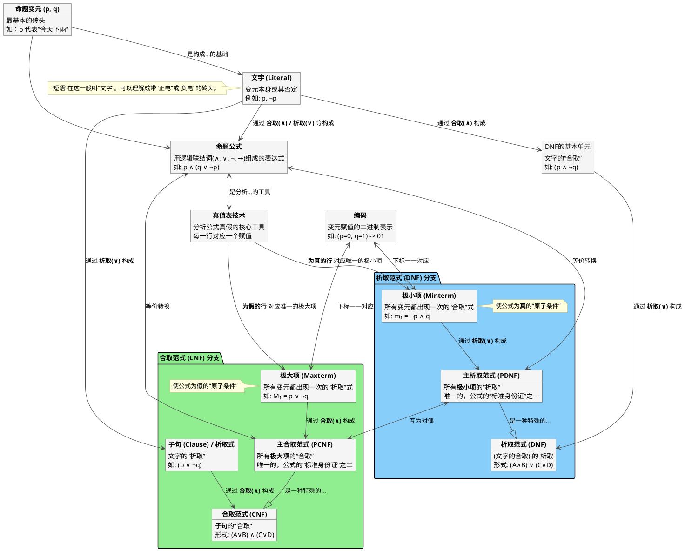

  
<!-- START doctoc generated TOC please keep comment here to allow auto update -->
<!-- DON'T EDIT THIS SECTION, INSTEAD RE-RUN doctoc TO UPDATE -->
**Table of Contents**  *generated with [DocToc](https://github.com/thlorenz/doctoc)*

- [思维导图](#%E6%80%9D%E7%BB%B4%E5%AF%BC%E5%9B%BE)
  - [命题与范式](#%E5%91%BD%E9%A2%98%E4%B8%8E%E8%8C%83%E5%BC%8F)
      - [1\. 一切的开始：从“砖头”到“句子”](#1%5C-%E4%B8%80%E5%88%87%E7%9A%84%E5%BC%80%E5%A7%8B%E4%BB%8E%E7%A0%96%E5%A4%B4%E5%88%B0%E5%8F%A5%E5%AD%90)
      - [2\. 分析主角的工具：真值表](#2%5C-%E5%88%86%E6%9E%90%E4%B8%BB%E8%A7%92%E7%9A%84%E5%B7%A5%E5%85%B7%E7%9C%9F%E5%80%BC%E8%A1%A8)
      - [3\. 两条主线：析取范式 (DNF) 与 合取范式 (CNF)](#3%5C-%E4%B8%A4%E6%9D%A1%E4%B8%BB%E7%BA%BF%E6%9E%90%E5%8F%96%E8%8C%83%E5%BC%8F-dnf-%E4%B8%8E-%E5%90%88%E5%8F%96%E8%8C%83%E5%BC%8F-cnf)
      - [4\. 补充说明](#4%5C-%E8%A1%A5%E5%85%85%E8%AF%B4%E6%98%8E)
- [命题](#%E5%91%BD%E9%A2%98)
  - [联结词](#%E8%81%94%E7%BB%93%E8%AF%8D)
    - [优先级](#%E4%BC%98%E5%85%88%E7%BA%A7)
  - [基本等价关系](#%E5%9F%BA%E6%9C%AC%E7%AD%89%E4%BB%B7%E5%85%B3%E7%B3%BB)
    - [逻辑电路简化](#%E9%80%BB%E8%BE%91%E7%94%B5%E8%B7%AF%E7%AE%80%E5%8C%96)

<!-- END doctoc generated TOC please keep comment here to allow auto update -->

  
# 思维导图

## 命题与范式
  
  

  
  
#### 1\. 一切的开始：从“砖头”到“句子”

*   **命题变元 (Propositional Variable)**：这就是最最基础的“原子”或者说“砖头”，比如 `p`、`q`。它本身代表一个非真即假的简单陈述。
*   **文字 (Literal)**：这个概念很重要。你给的词里有“短语”，但在标准逻辑里，我们通常叫它“文字”。它就是一个变元或者这个变元的“否定”，比如 `p` 和 `¬p`。你可以把它想象成带正电（p）和带负电（¬p）的砖头，比单个的砖头多了一点信息。
*   **命-题公式 (Propositional Formula)**：把这些“文字”用“合取 (∧, AND)”和“析取 (∨, OR)”这些逻辑胶水粘起来，就成了一个完整的“句子”，也就是命题公式。它是我们整个故事的主角。

#### 2\. 分析主角的工具：真值表

*   **真值表技术 (Truth Table)**：这玩意儿就是个“照妖镜”。无论一个公式多复杂，把它扔进真值表，它在所有可能性（所有变元的真假组合）下的结果是真是假，都一目了然。这是我们后面所有操作的基础。

#### 3\. 两条主线：析取范式 (DNF) 与 合取范式 (CNF)

现在，故事分成两条线了，就像一个公式可以有两种不同的“标准照”。

**路线一：析取范式（DNF）—— 找“真”**

*   **极小项 (Minterm)**：你看真值表里，那些让整个公式结果为 **真 (True)** 的行。每一行都对应一个“极小项”。极小项是个“合取”式，包含了所有变量，并且能精确匹配那一行的真假赋值。比如 `(p=0, q=1)` 对应的极小项就是 `¬p ∧ q`。它就像是某个案件中，能让“真相大白”的唯一一种关键线索组合。
*   **主析取范式 (PDNF)**：把所有能让公式为“真”的极小项，用“析取 (∨)”连起来，就成了主析取范式。因为它是由所有“真”的情况构成的，所以它和原公式是等价的。这是公式的第一个“标准身份证”，全球唯一。
*   **析取范式 (DNF)**：PDNF是一种要求很严格的DNF。普通的DNF没那么严格，只要整体结构是“合取式的析取”，比如 `(p) ∨ (¬p ∧ q)`，就算。

**路线二：合取范式（CNF）—— 排除“假”**

*   **子句 (Clause)**：这是CNF的基本单元，它本身是一个“析取”式，比如 `(p ∨ ¬q)`。
*   **极大项 (Maxterm)**：对应地，你看真值表里那些让公式结果为 **假 (False)** 的行。每一行都对应一个“极大项”。极大项是个“析取”式，它也包含了所有变量，并且它的值在那一行恰好为假。比如 `(p=0, q=1)` 对应的极大项是 `p ∨ ¬q`。它就像是案件中，必须被排除的一种“错误可能性”。
*   **主合取范式 (PCNF)**：把所有能让公式为“假”的极大项，用“合取 (∧)”连起来，就成了主合取范式。它的逻辑是“不能是这种情况，**并且**也不能是那种情况……”，通过排除所有错误，剩下的自然就是正确的。这是公式的第二个“标准身份证”，同样全球唯一。
*   **合取范式 (CNF)**：PCNF是严格版的CNF。普通的CNF只要结构是“析取式的合取”（也就是一堆子句的合取）就行。

#### 4\. 补充说明

*   **编码 (Encoding)**：这很好理解。就是给变元的真假赋值（比如 p=T, q=F）一个二进制编号（10）。这个编号 `i` 正好对应极小项 `mᵢ` 和极大项 `Mᵢ` 的下标，让找它们变得非常方便。
*   **总结一下**：任何一个命题公式，都能被唯一地表示成它的主析取范式（所有“真”的可能性的总和）和主合取范式（排除所有“假”的可能性的结果）。而真值表，就是找到这些“真”和“假”的可能性的核心方法。

# 命题

## 联结词

### 优先级
$$\lnot\ >\ \land\ >\ \lor\ >\ \to\ >\ \leftrightarrow$$

  
## 基本等价关系

  
  

  
  
  
  
### 逻辑电路简化
> 并联：$\lor$  
串联：$\land$

$$(\lnot G\lor H)\land(\lnot H\lor G)$$