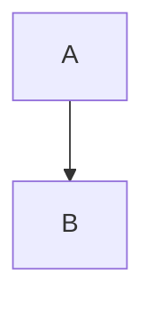
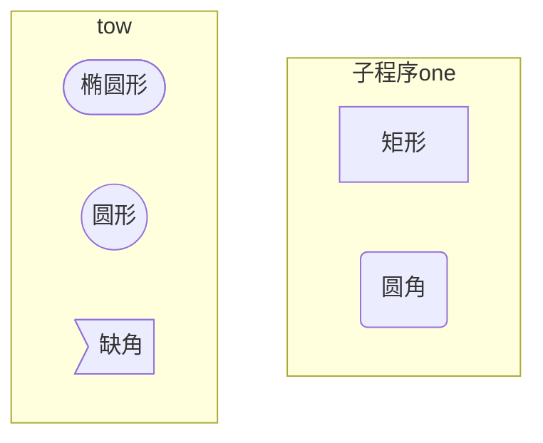
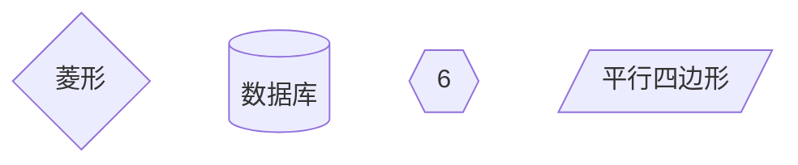
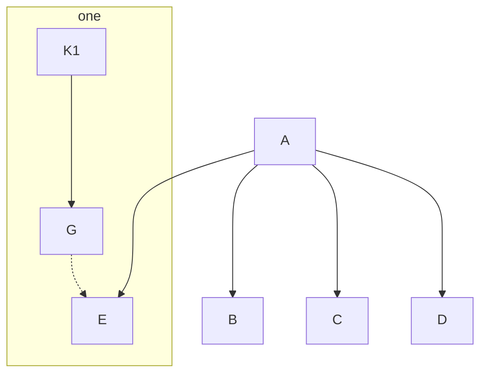
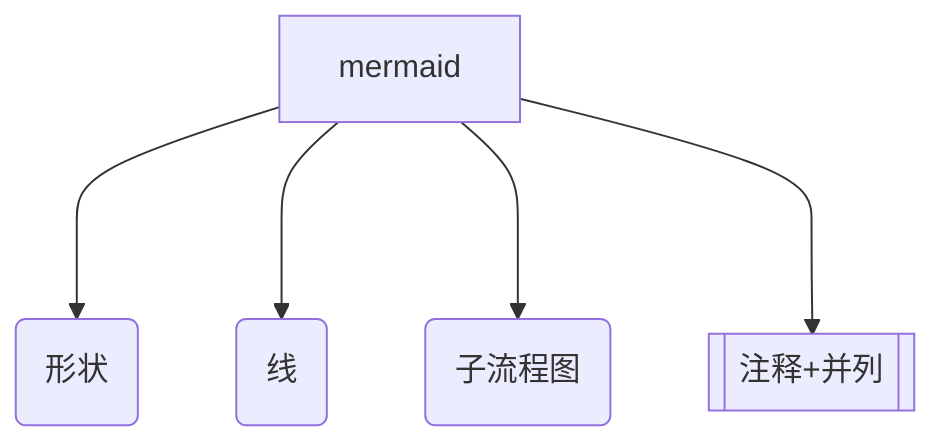

## 目录
[ijo]:#目录 "测试"
[ml]:#目录 "回到目录"

1. **<mark>[书写格式](#书写格式)</mark>**
    -  **[列表(有序、无序)](#列表)**
    - **[复选框](#复选框)**
    - **[代码块](#代码块)**
    - **[数学公式](#数学公式)**
    - **[脚注](#脚注)**
    - **[横线](#横线)**
    - **[字体(粗、斜、删除、下划、高亮)](#字体)**
    - **[函数高亮](#函数高亮)**
    - **[表情](#表情)**
2. **<mark>[链接跳转](#链接跳转)</mark>**
    - **[脚注](#脚注)**
    - **[行内、引用](#行内引用)**
    - **[标题跳转](#标题跳转)**
    - **[图片](#图片)**
3. **<mark>[流程图与序列图](#流程图与序列图)</mark>**


## 书写格式

[返回目录][ml]


### 引用
> 这里
> 是送
> 引用

### 列表

1. 有序排列
2. 是
3. 这样

- 无序列表
- 是
- 这样
* 还有
* 这样

### 复选框

- [ ] 计划
- [ ] 是
- [ ] 这样
- [x] 设定的

### 代码块

代码块：
```c
int main(){
    return 0;
}
```

### 数学公式
$$
\frac{\partial f}{\partial x} = 2\sqrt{a}x
$$

行内数学公式
$\theta=x^2$


### 表格
表格
| 姓名    |     年龄|     成绩|
| :-: | :-: | :-: |
|     |     |     |
|     |     |     |
|     |     |     |


### 横线
横线
---
哈哈哈

### 字体
*斜体*
**粗体**
~~删除~~

<u>下划线<u>

下标 H~2~O , 上标 X^2^

==高亮文字== <mark>高亮文字</mark>

### 函数高亮

函数

`printf()`

### 表情
表情 :
[表情符号汇总](https://unicode.org/emoji/charts/full-emoji-list.html)
 [表情单词备忘表](https://www.webfx.com/tools/emoji-cheat-sheet/)
:smile:
&#x1F600;


## 链接跳转


[返回目录][ml]


### 脚注

脚注：
我是脚注[^查看注释]

### 行内引用

链接
行内链接
[百度](https://baidu.com "这里是提示")

引用链接
[百度][id]

[id]:https://baidu.com "这里是引用链接的提示"

### 标题跳转

跳转标题请参考[Markdown][ijo]


### 图片

URL:
https://google.com


图片


## 流程图与序列图


[返回目录][ml]

[流程图与序列图](https://blog.csdn.net/subson/article/details/75126945)




流程图

```flow
st=>start: 开始 :>https://www.baidu.com
op=>operation: 你的操作|:>#h 
happy=>operation: :smile：
sub=>subroutine: 子程序
cond=>condition: 是 / 否?
i=>inputoutput: 输入
o=>inputoutput: 输出
e=>end
st(right)->op->cond
cond(yes)->sub->o->e
cond(no)->i->op
```


[mermaid参考](https://www.jianshu.com/p/598b121bdbef)

方向：
TB 上下  BT 下上
RL 右左  LR 左右

形状




|      命令      |   作用   |
| :------------: | :------: |
|    A --> B     | 直线箭头 |
|     A -- B     |   直线   |
|       ==       |  加粗线  |
|      -.-       |   虚线   |
| A ---\|text\|B |  加注释  |
| A --text--- B  |  加注释  |




