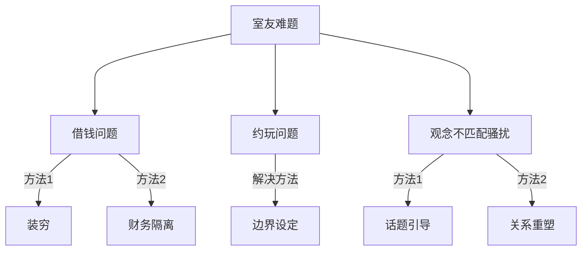

  

---

### 装穷法
1.  选择私密场合，用"我"句式表达感受（如"我最近经济压力很大，可能没法继续支持你了"）

2. 若对方询问原因，灵活应变，可以从自身，也可以从家里原因（如"我准备存钱买xxx，多出来的钱放在银行吃死期利息，剩下的只够我自己吃用", "家里准备买房，经济吃紧，每一笔开销都要记账，给的钱只够吃用"）
    
3.  明确表示今后不再提供借款和支付消费
    
4.  保持温和但坚定的语气

---

### 财务隔离
1.  开通独立电子账户存放主要资金
    
2.  展示空钱包/余额不足截图
    
3.  使用记账APP时"无意间"让对方看到收支明细

---

### 边界设定法

1.  提前制定消费规则（如"以后AA制聚餐我才参加"）
    
2.  使用荷包，零钱通等，出去玩只转入少量钱，超过即称"钱包限额"
    
3.  对礼物要求回应"我也在存钱买XX，不如我们互送手工礼物？"
  
---
  
### 话题引导
**1\. 话题冷冻法**  
当对方开启情感话题时：

*   使用「中性回应+事务转移」话术：
    
    *   "感情问题好复杂啊，对了你明天早课课件下载了吗？"
        
    *   "这个我不太懂，你要不要试试情感电台咨询？"
        

**2\. 镜像反弹术**

*   在对方评价男性时反问：
    
    *   "你觉得他哪里吸引你呢？"
        
    *   "如果换作是你，会接受这种相处模式吗？"
        

**3\. 技术性掉线**

*   视频高峰时段佩戴耳机看学习视频（营造沉浸氛围）
    
*   对方试图搭话时指耳朵摇头，展示手机便签："在练听力"
    
  
---
  
### 关系边界重塑
**1\. 非暴力沟通模板**  
"当你在晚上视频时（具体行为），  
我发现很难集中精神学习（客观影响），  
能不能在23点后改用文字聊天？（明确需求）  
我们可以把周五晚上定为自由社交时间（替代方案）"

**2\. 利益交换机制**

*   "如果你需要安静环境约会，我可以去图书馆2小时"
    
*   "作为交换，我午休时希望保持寝室安静"
    

**3\. 关系降维法**

*   将亲密室友关系调整为"友好同学关系"
    
*   减少生活细节分享，增加外出学习频率  
  
  
#### **性格适配技巧**

| 你的潜在顾虑 |      应对方案      |         应急话术          |
| ------------ | ----------------- | ------------------------- |
| 怕伤对方自尊 | 用"我们"替代"你"   | "我们都需要调整下作息"     |
| 担心被孤立   | 拓展外部社交圈     | "我参加了读书社要常去活动" |
| 纠结是否多心 | 制作《影响记录表》 | "上周有四次超过23点的通话" |

  
  

