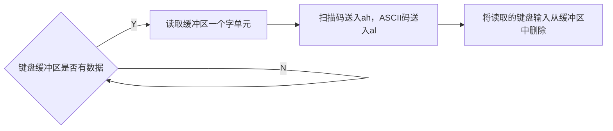

  
<details><summary>目录</summary>
{{"
<!-- START doctoc generated TOC please keep comment here to allow auto update -->
<!-- DON'T EDIT THIS SECTION, INSTEAD RE-RUN doctoc TO UPDATE -->


  - [直接定址表](#%E7%9B%B4%E6%8E%A5%E5%AE%9A%E5%9D%80%E8%A1%A8)
    - [移位指令](#%E7%A7%BB%E4%BD%8D%E6%8C%87%E4%BB%A4)
    - [操作显存](#%E6%93%8D%E4%BD%9C%E6%98%BE%E5%AD%98)
    - [数据标号与地址标号](#%E6%95%B0%E6%8D%AE%E6%A0%87%E5%8F%B7%E4%B8%8E%E5%9C%B0%E5%9D%80%E6%A0%87%E5%8F%B7)
    - [代码定址](#%E4%BB%A3%E7%A0%81%E5%AE%9A%E5%9D%80)
  - [内中断](#%E5%86%85%E4%B8%AD%E6%96%AD)
    - [中断的概念+概览](#%E4%B8%AD%E6%96%AD%E7%9A%84%E6%A6%82%E5%BF%B5%E6%A6%82%E8%A7%88)
    - [中断处理过程：](#%E4%B8%AD%E6%96%AD%E5%A4%84%E7%90%86%E8%BF%87%E7%A8%8B)
    - [编写中断处理程序](#%E7%BC%96%E5%86%99%E4%B8%AD%E6%96%AD%E5%A4%84%E7%90%86%E7%A8%8B%E5%BA%8F)
    - [单步中断 TF和IF](#%E5%8D%95%E6%AD%A5%E4%B8%AD%E6%96%AD-tf%E5%92%8Cif)
    - [int n中断](#int-n%E4%B8%AD%E6%96%AD)
    - [BIOS和DOS中断处理](#bios%E5%92%8Cdos%E4%B8%AD%E6%96%AD%E5%A4%84%E7%90%86)
  - [端口及外设控制](#%E7%AB%AF%E5%8F%A3%E5%8F%8A%E5%A4%96%E8%AE%BE%E6%8E%A7%E5%88%B6)
    - [端口的读写](#%E7%AB%AF%E5%8F%A3%E7%9A%84%E8%AF%BB%E5%86%99)
    - [CMOS RAM芯片](#cmos-ram%E8%8A%AF%E7%89%87)
  - [外中断](#%E5%A4%96%E4%B8%AD%E6%96%AD)
    - [中断过程](#%E4%B8%AD%E6%96%AD%E8%BF%87%E7%A8%8B)
    - [键盘处理过程](#%E9%94%AE%E7%9B%98%E5%A4%84%E7%90%86%E8%BF%87%E7%A8%8B)
    - [案例：程序内自定义键盘输入处理](#%E6%A1%88%E4%BE%8B%E7%A8%8B%E5%BA%8F%E5%86%85%E8%87%AA%E5%AE%9A%E4%B9%89%E9%94%AE%E7%9B%98%E8%BE%93%E5%85%A5%E5%A4%84%E7%90%86)
    - [案例：改写~~~~中断例程常驻内存](#%E6%A1%88%E4%BE%8B%E6%94%B9%E5%86%99%E4%B8%AD%E6%96%AD%E4%BE%8B%E7%A8%8B%E5%B8%B8%E9%A9%BB%E5%86%85%E5%AD%98)
    - [中断操作外部设备](#%E4%B8%AD%E6%96%AD%E6%93%8D%E4%BD%9C%E5%A4%96%E9%83%A8%E8%AE%BE%E5%A4%87)
    - [案例：从键盘缓冲区读取输入，并更改屏幕颜色](#%E6%A1%88%E4%BE%8B%E4%BB%8E%E9%94%AE%E7%9B%98%E7%BC%93%E5%86%B2%E5%8C%BA%E8%AF%BB%E5%8F%96%E8%BE%93%E5%85%A5%E5%B9%B6%E6%9B%B4%E6%94%B9%E5%B1%8F%E5%B9%95%E9%A2%9C%E8%89%B2)
    - [案例：字符串输入](#%E6%A1%88%E4%BE%8B%E5%AD%97%E7%AC%A6%E4%B8%B2%E8%BE%93%E5%85%A5)
    - [磁盘读写](#%E7%A3%81%E7%9B%98%E8%AF%BB%E5%86%99)
    - [外部设备中断学习扩展 与计算机唱歌案例](#%E5%A4%96%E9%83%A8%E8%AE%BE%E5%A4%87%E4%B8%AD%E6%96%AD%E5%AD%A6%E4%B9%A0%E6%89%A9%E5%B1%95-%E4%B8%8E%E8%AE%A1%E7%AE%97%E6%9C%BA%E5%94%B1%E6%AD%8C%E6%A1%88%E4%BE%8B)
        - [拓展_微机原理与接口技术](#%E6%8B%93%E5%B1%95_%E5%BE%AE%E6%9C%BA%E5%8E%9F%E7%90%86%E4%B8%8E%E6%8E%A5%E5%8F%A3%E6%8A%80%E6%9C%AF)
        - [计算机唱歌相关硬件控制](#%E8%AE%A1%E7%AE%97%E6%9C%BA%E5%94%B1%E6%AD%8C%E7%9B%B8%E5%85%B3%E7%A1%AC%E4%BB%B6%E6%8E%A7%E5%88%B6)
        - ['翻译'乐谱](#%E7%BF%BB%E8%AF%91%E4%B9%90%E8%B0%B1)
        - [演奏程序](#%E6%BC%94%E5%A5%8F%E7%A8%8B%E5%BA%8F)

<!-- END doctoc generated TOC please keep comment here to allow auto update -->

" | markdownify }}
</details>

  
### 直接定址表
---
  
#### 移位指令
> 语法与原理注意事项：  
* 位移时，移出位放入CF中
* CNT 为 1 时必须填立即数 1，大于1时，需使用cl
  
原理：  
* 进行左/右 移位
* 移出位放入 CF
* 补位
    * 逻辑移位
        * 补 0
        * 循环移位 补移出位
    * 算数移位
        * 左移补 0
        * 右移补最高位，保持最高位不变
    * 带进位循环
        * 将原先CF中的位，用作补位

1. 逻辑移位
    * SHL OPR, CNT - 左移
    * SHR OPR, CNT - 右移
    * ROL OPR, CNT - 循环左移
    * ROR OPR, CNT - 循环右移
2. 算数移位
    * SAL OPR , CNT - 左移
    * SAR OPR , CNT - 右移
3. 带进位循环
    * RCL OPR, CNT - 左移
    * RCR OPR, CNT - 右移
  
> S: shift  RO/R: rotate  C: carry  A: arithmetic  
OPR: operand   CNT: count
{: .prompt-tip }  
  
  
#### 操作显存
显存：显存的数据，即屏幕上的内容  
8086中的显存举例：  
1. 显存地址：B8000h~Bffffh 32k  
2. 缓冲区结构：25行 x 80列(每行160个字节，表示80个字符)  
3. 显存数据：显示字符(1字节)+显示属性(1字节)  
    * 显示属性：
        * 7~4 - 闪烁RGB 背景   
        * 3~0 - 高亮RGB 前景
        
总结：  
* 显存大小 - 32k  
* 一页有 25 行、80 列，每行显示80个字符
    * 一页共有 2000 个字符，4000个字节
    * 共有8页
* 每个字符由 2个字节表示 (1字节ASCII码，1字节颜色)


地址空间：  
  
  
缓冲区结构：  

  
表示数据：  

  
  
#### 数据标号与地址标号
> 地址标号与数据标号的区别:  
1. 地址标号 只能在 code 段使用
    * 直接关联 内存地址
2. 数据标号 既可以在 code 段，也可以在 data 段使用
    * 关联到对应段基址的 偏移地址
{: .prompt-tip }
作用：
1. 可以直接作为偏移地址使用
2. 若是直接用作算术指令
3. 则表示对应的内存单元。  
    * `a db 1,2`则， `(a)` 默认表示 1 字节的内存单元
    * `b dw 0`则， `(b)` 默认表示 1字长 / 2 字节的内存单元
使用：地址标号去掉冒号，即是数据标号  
```nasm
code segment
    a db 1,2,3
    b dw 0
;作为地址使用
mov al, a[si]; 即将cs:[a+si]的内存单元移动到al中
;作为内存单元使用
add a, ax; 即，将 cs:[a] 中的数据 与 ax 相加后存入 cs:[a]中
```  
  
扩展用法：  
* 用法1：
```nasm
data segment
  a db 1,2
  b dw 0
  c dw a,b
  ;c dw offset a, offset b
```
* 用法2
```nasm
data segment
  a db 1,2
  b dw 0
  c dd a,b
  ;c dw offset a, seg a, offset b, seg b
```
  
#### 代码定址
```nasm
assume cs:codesg, ss:stacksg, ds:datasg
; 0 清屏
; 1 设置前景
; 2 设置背景
; 3 向上滚动
; ah放功能号，hl 放颜色

stacksg segment
    dw 16 dup(0)
stacksg ends

datasg segment
    func dw sub1;, shub2, sub3, sub4
datasg ends

codesg segment
start:
    mov ax, datasg
    mov ds, ax
    mov ax, stacksg
    mov ss, ax
    mov sp, 16
    mov ah, 0
    mov al, 2
    call setscreen
    mov ax, 4c00h
    int 21h

setscreen:
    push bx
    mov bl, ah
    mov bh, 0
    add bx, bx
    call word ptr func[bx]
    pop bx
    ret

sub1:
    push ax
    push es
    push di
    push cx

    mov ax, 0B800H
    mov es, ax
    mov di, 0
    mov cx, 2000
s1:
    mov byte ptr es:[di], 32
    inc di
    inc di
    loop s1
s1ret:
    pop cx
    pop ax
    pop es
    pop di
    ret
codesg ends
end start
```
  
  
### 内中断  
---
#### 中断的概念+概览
大意：CPU执行完某一条指令后，不向下执行，转去处理中断信息。  
  

$$中断=\begin{cases}
内中断(CPU内部的事件引起)\begin{cases}除法错误(div除法溢出等):0\\
单步执行(指令)：1\\
into 指令(溢出错误):4\\
int\ n指令：n
\end{cases}\\
外中断(外部设备的事件引起)\end{cases}$$  
  

左边为内中断，右边为外中断  
    
    
#### 中断处理过程：  
>中断的执行控制:  中断过程由CPU的硬件自动完成
{: .prompt-tip }
  

$程序\overset{保存现场,进入入口}{\underset{中断返回}{\rightleftharpoons}}中断程序$  
  
$$指令中断\begin{cases}
1.获取中断类型码N\\
2.标志寄存器值 入栈 -- 中断过程会改变该值，入栈保护\\
pushf\\\\
3.设置标志寄存器的第8位TF和第9位IF为0\\
TF=0,IF=0\\\\
4.CS、IP入栈\\
push CS, push IP\\\\
5.类型码\xrightarrow[查表取地址]{*中断向量表}处理程序入口地址，设置IP、CS\\
(IP)=(N*4),(CS)=(N*4+2)
\end{cases}$$
  
中断向量表:  
* 大小：1024字节
* 存储顺序：IP+CS  
* 共可存储：256地址(1024/IP+CS)
* 向量表内存地址： 0000:0000~0000:03FF
* 中断入口地址：(IP)=(N\*4),(CS)=(N\*4+2) -N为类型码
    * 这里的(IP) / (CS) 为偏移地址，段地址为0000


#### 编写中断处理程序
$编制的方法\begin{cases}向系统申请程序存放空间\\利用向量表的空闲单元存放\end{cases}$  
  
中断向量表的存储机制  
* 向量表内存地址： 0000:0000~0000:03FF
* 大小：1KB
* 8086支持 256 个中断(事实上的中断事件远没有256个)
  
程序存放：
* 预估程序长度是否超过256个字节
* 不超过时，通常放在 0000:0200~0000:02FF的256个字节空间
  
程序编制过程：  
$$编制流程\begin{cases}
1.编写中断程序(常驻内存的程序)\\
2.将程序写入中断送入系统空闲内存(通常是中断向量表地址)\\
3.修改对应类型码中向量表的内存单元，使其指向写入的中断程序入口地址
\end{cases}$$
  

  
#### 单步中断 TF和IF
>Debug中的 t命令，即是单步中断的应用  
{: .prompt-tip }  
原理：  
两个与中断相关的，标志寄存器的标志位  
1. TF(Trap Flag) —— 陷阱标志，由系统控制计算机
    * TF=1，每条指令执行完，产生陷阱
    * TF=0，不产生陷阱
2. IF(Interupt Flag) —— 中断标志
    * IF=1，CPU可屏蔽中断请求
    * IF=0，关闭中断
    
##### 中断不响应的情况
>通常情况，CPU在指令执行后，若检测到中断信息，会响应中断  
特殊情况下，发生中断时，CPU不会响应  
  
案例：  栈的设置  
* 原因：ss:sp联合指向栈顶，对他们的设置需连续完成
* 保证对栈的正确操作，CPU会一次性执行两条指令
```nasm
mov ax,100
mov ss,ax;调试时，会在这里一次性执行两条指令
;mov ax, 0   在栈的设置中间插入指令，是不被允许的
mov sp,10
```
  
#### int n中断
可以通过`int n` 引发任意类型码的中断错误  
例如：`int 0`引起除法错的中断  
>中断过程：  
1. 取中断类型码n
2. 标志寄存器入栈，IF=0, TF=0
3. CS、IP入栈
4. (IP)=(n\*4), (CS)=(n\*4+2)
  
功能作用：类似于`call`指令，可以通过`int n`指定类型码，引发对应中断程序  
  
$$中断例程编写\begin{cases}
1.安装中断例程\\
2.设置中断向量表\\
3.编写中断例程程序\\
4.调用
\end{cases}$$
相关步骤：  
1. 安装
    * 设置例程开始和结束的标号
    * 通过offset 计算子程序代码大小
    * 通过es:di, ds:si 和 rep 拷贝代码到指定地址
2. 设置
    * 更改类型码对应的内存单元内容
    * 指向 安装的入口地址
3. 编写子程序
    * 使用 iret 返回
    * iret自动执行 pop IP, pop CS, popf
4. 调用
    * 自动执行
    * pushf,  push CS, push IP
    
##### 案例1：平方  

  
##### 案例2：字符串大小写转换  


  


#### BIOS和DOS中断处理
>BIOS(Basic IO System) 基本输入输出系统， 对应主板上的两块ROM芯片，在上面存放着的一套程序。  
BIOS存储信息：  
* 容量：8KB
* 地址：FE000H开始
主要功能：  
1. 硬件系统检测和初始化程序
2. 内部中断和外部中断的 中断例程
3. 设备I/O操作的 中断例程
4. 系统相关的 中断例程
BIOS调用的应用特点：  
1. 方便编程
    * (可以不用了解硬件细节，通过指令参数直接调用完成工作)
2. 简洁、可读性好、易于移植
{: .prompt-tip }
  
  
##### BIOS和DOS的区别
1. 存放位置
    * BIOS中断 —— ROM芯片
    * DOS中断 —— DOS
2. 依赖关系
    * DOS中断 依赖于 BIOS中断
3. 调用优先
    * 用户优先调用DOS中断(能提供更高级的例程)
    * 也可直接调用外设

  
  
##### 调用示例
###### BIOS中断调用示例  
功能：5行12列显示 3个红底高亮闪烁绿色的 'a'字符  
```nasm
assume cs:code
code segment
    mov ah, 2   ;置光标功能
    mov bh, 0   ;第0页
    mov dh, 5   ;dh存放行号
    mov dl, 12  ;dl存放列号
    int 10h

    mov ah, 9   ;显示字符功能
    mov al, 'a' ;字符
    mov bl, 11001010b   ;颜色属性
    mov bh, 0   ;第0页
    mov cx, 3   ;字符重复个数
    int 10h

    mov ax, 4c00h
    int 21h
code ends
end
```
  
  
###### DOS调用示例
功能：int 21H 
功能号在 `ah`，返回结果在 `al`
* 4c号功能 —— 程序返回
* 09号功能 ——     在光标位置显示字符串
    * ds:dx指向要显示的字符串 ($结束)
```nasm
assume cs:code
 data segment 
    db 'Welcome to masm!','$'
 data ends
 code segment
 start: mov ah,2   ; 置光标
       mov bh,0  ; 第0页
       mov dh,5  ; dh中放行号
       mov dl,12    ; dl中放列号
       int 10h
       mov ax,data
       mov ds,ax
       mov dx,0    ;ds:dx指向字符串的首地址data:0
       mov ah,9
       int 21h
       mov ax,4c00h
       int 21h 
code ends
end start
```
  
  
##### BIOS中断类和DOS中断类
###### BIOS中断类
>概览， 不全
1. 显示服务(Video Service —— INT 10H)
    * 功能号(ah)：00H ~ 1CH
    * 例：09H —— 在光标处按指定属性显示字符
2. 直接磁盘服务(Direct Disk Service —— INT 13H)
3. 串行口服务(Serial Port Service —— INT 14H)
4. 杂项系统服务(Miscellaneous System Service —— INT 15H)
5. 键盘服务(Keyboard Service —— INT 16H)
6. 并行口服务(Parallel Port Service —— INT 17H)
7. 时钟服务(Clock Service —— INT 1AH)
8. 直接系统服务(Direct System Service)

<a href="{{ "/assets/pdf/BIOS和DOS中断大全.pdf" | relative_url }}" download>BIOS和DOS中断大全.PDF</a>
<iframe src="{{ "/assets/pdf/BIOS和DOS中断大全.pdf" | relative_url }}" width="100%" height="600px"></iframe>
  
  
###### DOS中断类
1. INT 20H —— 终止程序运行
2. INT 21H —— 功能调用
3. INT 22H —— 终止处理程序的地址
4. INT 23H —— `Ctrl+C` 处理程序
5. INT 24H —— 致命错误处理程序
6. INT 25H —— 读磁盘扇区(忽略逻辑结构)
7. INT 26H —— 写磁盘扇区(忽略逻辑结构)
8. INT 27H —— 终止，并驻留在内存
9. INT 28H —— DOS 空闲
10. INT 2FH —— 多重中断服务
11. INT 33H —— 鼠标功能
  
  
##### BIOS和DOS中断例程的安装  
>由系统自动完成
{: .prompt-tip }
1. CPU加电
    * 初始化 (CS)=0FFFFh, (IP)=0
2. 从FFFF:0单元(跳转指令)执行程序
    * 转移到BIOS的硬件系统检测和初始化程序
3. 初始化
    * 建立BIOS所支持的中断向量
    * 将BIOS提供的中断例程的入口地址，登记在中断向量表
4. 硬件检测和初始化完毕，调用`int 19h`
    * 进行操作系统的引导
    * 此后，由操作系统接管计算机
5. DOS启动后
    * 装入DOS中断例程
    * 并建立相应的中断向量

  
### 端口及外设控制
---
>端口作用：提供CPU与外部设备之间的通信功能
{: .prompt-tip }
$$端口\xrightarrow{对应}\begin{cases}
各种接口卡、网卡、显卡等\\
主板上的接口芯片\\
其它芯片
\end{cases}$$
  

$$CPU角度\begin{cases}
现象：芯片的工作均有一些寄存器由CPU读写\\
方法：将寄存器当端口，同一编址(64K地址空间)\\
好处：统一的方法与各种设备通信\\
读写端口的指令: in\ -\ 从端口读取,\ out\ -\ 往端口写入
\end{cases}$$

  
#### 端口的读写
>注意事项：  
1. 对0～255以内的端口进行读写，端口号用立即数给出
    * `in al,20h` ;从20h端口读入一个字节
    * `out 21h,al` ;往21h端口写入一个字节
2. 对256～65535的端口进行读写时，端口号放在dx中：
    * `mov dx,3f8h` ;将端口号3f8送入dx
    * `in al,dx` ;从3f8h端口读入一个字节
    * `out dx,al` ;向3f8h端口写入一个字节
3. 在in和out 指令中
    * 只能使用 ax 或al 来存放对端口读写的数据。    
    * 访问8 位端口时用 al ，访问 16 位端口时用ax
    * 需要通过查找手册，来确定端口的位数
{: .prompt-tip }


端口读写的原理机制：  
例：`in al, 60h`  
操作
1. CPU将60h，通过地址线发出
2. CPU通过控制线，选中60h端口所在芯片，发出端口读命令
3. 端口所在的芯片通过数据总线，将60h端口中的数据送入CPU


##### I/O端口分配表  

| I/O 地址 |           分配说明           | I/O 地址 |       分配说明        |
| -------- | --------------------------- | -------- | -------------------- |
| 00-1f    | 8237A DMA控制器1             | 170-177  | IDE硬盘控制器1        |
| 20-3f    | 8259A 可编程中断控制器1      | 1f0-1f7  | IDE硬盘控制器2        |
| 40-5f    | 8253/8254可编程中断计数器    | 278-27f  | 并行打印机端口2       |
| 60-6f    | 8255A可编程外设接口电路       | 2f8-2ff  | 串行控制器2           |
| 70-71    | 访问CMOS RAM/实时时钟RTC端口 | 378-38f  | 并行打印机端口1       |
| 80-9f    | DMA页面寄存器访问端口         | 3b0-3bf  | 单色MDA显示控制器     |
| a0-bf    | 8259 可编程中断控制器2       | 3c0-3cf  | 彩色CGA显示控制器     |
| c0-df    | 8237A DMA控制器2             | 3d0-3df  | 彩色EGA/VGA显示控制器 |
| f0-ff    | 协处理器访问端口             | 3f8-3ff  | 串行控制器1           |
  
##### 声卡端口读写示例
```nasm
assume cs:codeseg
 codeseg segment
 start: mov al, 08h ;设置声音的频率
        out 42h, al       
        out 42h, al  
        in al, 61h  ;读设备控制器端口原值
        mov ah, al  ;保存原值     
        or al, 3    ;打开扬声器和定时器
        out 61h, al ;接通扬声器，发声
        mov cx, 60000;延时
delay:
        nop
        loop delay
        mov al, ah  ;恢复端口原值
        out 61h, al
        mov ax, 4c00h
        int 21h
 codeseg ends
 end start
```
  
  

#### CMOS RAM芯片
>英文全写是 "Complementary Metal-Oxide-Semiconductor Random Access Memory"。 CMOS RAM是一种使用互补金属氧化物半导体（CMOS）技术制造的随机存取内存。  
在CMOS芯片中，通常是只有一个实时钟（Real-Time Clock, RTC）模块，该模块同时负责时间管理和系统的时钟运行。CMOS芯片内的128字节RAM存储空间是用于保存与系统配置相关的信息，例如硬件设置、引导顺序等，并且依赖RTC进行时间的管理，因此两者实际上并不是两个独立的RTC，而是同一个RTC模块的不同功能部分。
    *   作用是跟踪当前的时间，包括年、月、日、小时、分钟和秒。即使系统断电后，RTC模块依然能够保持计时，通过主板上的电池供电。
    *   CMOS RTC提供稳定的时钟信号，用于控制系统启动、硬件配置、系统事件等时间相关的功能。
    *   在系统启动时，操作系统会从RTC读取当前时间，之后再通过系统时钟来维护时间信息。
2.  **CMOS RAM**
    *   CMOS中的128字节RAM用于存储系统的配置信息，如硬盘类型、引导顺序、内存大小、系统时间和日期等。它在系统关闭后依然可以保持这些设置数据，因为CMOS芯片电池在持续供电。
    *   系统启动时，BIOS会从CMOS RAM中读取配置数据，以确保硬件的正常配置和初始化。
{: .prompt-tip }

$$
CMOS\ RAM芯片\begin{cases}
组成：\begin{cases}
实时钟\\
128个存储单元的RAM存储器:\begin{cases}
内部实时钟\\
系统配置信息\\
相关程序(用于开机时配置系统信息)
\end{cases}\\
\end{cases}\\
特点：靠电池供电，关机后实时钟仍可正常工作，RAM信息不丢失\\
端口：\begin{cases}
70h地址端口:\ 存放需要访问的CMOS RAM单元地址\\
71h数据端口：读取、或写入的端口
\end{cases}
\end{cases}
$$
  
##### 端口操作示例
操作类型：提取CMOS RAM中存储的时间信息  
背景知识：时间在内存的存放  
* 6个字节 
* 00、02、04、07、08、09分别代表 秒分时、日月年
* 每个时间单位的存储长度均为 1字节
* 
* 时间信息用BCD码[^BCD]存放
    
[^BCD]:即二进制编码十进制（Binary-Coded Decimal），是一种表示数字的方法，特别常用于在计算机系统中表示十进制数。每一个十进制数被独立地转换为其对应的四位二进制数。例如：    <br> 比如 259，在 BCD 表示中是： <br> 2 用 4 位表示为 0010 <br> 5 用 4 位表示为 0101 <br> 9 用 4 位表示为 1001 <br> 所以，十进制 259 在 BCD 中则被表示为 0010 0101 1001。 <br> BCD码的优点主要在于它可以更容易地实现十进制数与二进制数之间的转换，特别是在需要显示设备的场合，比如数字钟表或计算器中。 但由于每个十进制数字都单独编码，它比纯粹的二进制表示法更占用存储空间。  
  

具体操作：在屏幕中间显示当前月份  
1. 从CMOS RAM中读出月份的BCD码
    1. 确认月份所在的单元地址 8
    2. 向地址端口(70h)中写入月份的地址(8)
        * `mov al, 8`
        * `out 70h, al`
    3. 从读写端口(71h)中读出月份的数据
        * `in al, 71h`
2. 将使用BCD码表示的月份以十进制的形式显示在屏幕上
    1. 分离BCD码的前、后四位(分离个、十位)
    2. 将分离出来的个位、十位转为 ASCII码
        * ASCII码值 = BCD码值 + 30h
    3. 显示
    
```nasm
assume cs:code
 code segment
 start:mov al,8    ;取得月份数据
      out 70h,al
      in al,71h
      mov ah,al    ;分离月份的十、个位
      mov cl,4
      shr ah,cl
      and al,00001111b
      add ah,30h    ;转换为ASCII码
      add al,30h
      mov bx,0b800h    ;显示
      mov es,bx
      mov byte ptr es:[160*12+40*2],ah 
      mov byte ptr es:[160*12+40*2+2],al
      mov ax,4c00h
      int 21h
 code ends
 end start
```
  
  
### 外中断
---
>定义：由外部设备发生的事件引起的中断  
具体：CPU在执行指令过程中，检测到中断信息，引发中断过程，处理外设输入。 
  <br>
不同外部设备的处理过程各有特点, 处理流程上类似，具体用到某个设备时，需要查手册  
{: .prompt-info }  
---

$$
外中断\begin{cases}
可屏蔽中断\begin{cases}
定义：\\
1.\ CPU可不响应的外中断\\
2.\ 是否相应取决于IF位的设置\\
（IF=1，引发中断，反之屏蔽中断）\\\\
情形：\\
几乎所有外设引发的外中断，比如键盘输入、打印机请求
\end{cases}
\\
\\
不可屏蔽中断\begin{cases}
定义：\\
1.\ CPU必须响应的中断\\
2.\ CPU检测到该中断时，在执行完当前指令后，立即响应\\
3.\ 对于8086CPU\ 不可屏蔽中断的终端类型码固定为2\\\\
情形：\\
在系统必须处理的紧急情况时，用来通知CPU的中断信息(如断电保护)
\end{cases}
\end{cases}
$$
  
#### 中断过程
>8086CPU 提供的设置IF指令：  
* sti，设置IF=1
* cli，设置IF=0
{: .prompt-info }

##### 可屏蔽中断过程  
1. 取中断类型码
    * 中断信息来自CPU外部，类型码通过数据总线送入CPU
    * 对比内中断：中断类型码在CPU内部产生
2. 标志寄存器入栈，IF=0, TF=0
    * IF置0的原因：进入中断处理程序后，禁止其它可屏蔽中断
    * 若在中断处理程序中需要可屏蔽中断，则用指令将IF置1
3. CS、IP入栈
4. (IP)=(n\*4), (CS)=(n\*4+2)
  
##### 不可屏蔽中断过程  
* 中断值固定为2
1. 标志寄存器入栈，IF=0，TF=0
2. CS、IP入栈
3. (IP)=8，(CS)=0AH
  
#### 键盘处理过程
>  
###### BIOS键盘缓冲区
* 作用：保存输入的<mark>字符键</mark>
* 存储：可存储**15**个键盘输入
    * 16个字的大小，以循环数组的数据结构存储(环形队列)
    * 一个键盘输入占 1字 单位
    * 高字节存放 扫描码，低字节存放 字符码  
<br>
* ###### 键盘状态字节
    * 一个字节的信息
    * 存放在 0040:17 位置
    * 专门用来记录键盘状态

{: .prompt-info }

1. 键盘输入
    * [按键按下与松开时的操作](#按键操作)
    * [扫描码](#扫描码)
2. 引发9号中断
    * 发出可屏蔽中断信息键盘
        * 输入抵达 60H端口时，相关芯片发出类型码为9的可屏蔽中断信息
    * CPU处理中断信息
        * IF=1，响应中断，引发中断过程后，转去执行`int 9`中断例程
3. 执行`int 9`中断例程
    * 读出 60H 端口中的扫描码
    * [根据扫描码类型进行操作](#扫描码的处理操作)
    * 对键盘系统进行相关的控制，如向相关芯片发出应答信息
    
###### 扫描码的处理操作
1. 字符键的扫描码
    * 将该**扫描码**与其对应的**字符码**(ASCII码)送入内存中的 [BIOS键盘缓冲区](#bios键盘缓冲区)
2. 控制键 或 切换键的扫描码
    * 将其转变为状态字节，写入内存中的存储状态字节的单元
  
###### 按键操作
* 每一个键相当于一个开关
* 键盘中有一个芯片对这些键的开关状态进行扫描

---

1. 按下时的操作
    * 开关接通，芯片产生扫描码(说明按下键的位置)
    * 扫描码送入主板中地址为 60H 端口的寄存器中
2. 松开时的操作
    * 产生扫描码(说明松开键的位置)
    * 送入 60H端口
  
  
###### 扫描码
* 由8位二进制表示
* 按下键 —— 通码，第8位=0
* 松开键 —— 断码，第8位=1
* 二者区别：通码+80H=断码
案例：  

<br><br>  
键盘上所有键的通码  

  
#### 案例：程序内自定义键盘输入处理
实现功能：  
1. [屏幕中间依次显示 'a-z'](#依次显示字符)
2. [显示过程中，按`Esc`键，改变显示颜色](#修改中断例程)  
<br><br>[完整实现](#自定义键盘输入实现)


###### 依次显示字符
1. 显示：将字符依次写入 显存中
2. 延时：显示一个字符后，延时一段时间
  
  
```nasm
assume cs:code
code segment
start:
    mov ax, 0b800h
    mov es, ax
    mov ah, 'a'
    s: mov es:[160*12+80], ah
    inc ah
    call delay
    cmp ah, 'z'
    jna s
    mov ax, 4c00h
    int 21h

delay:
    push dx
    push ax

    mov dx, 9h
    mov ax, 0
    s1:sub ax, 1
    sbb dx, 0
    cmp dx, 0
    jne s1

    pop ax
    pop dx
    ret
code ends
end start
```
  
  
###### 修改中断例程
>需求：在`Esc`键按下时，触发事件，其余保持不变  
{: .prompt-warning }
* 处理中断例程细节
    * 手动处理 `int n`自动完成的中断过程
    * 标志寄存器、CS/IP的处理，和原例程调用
* 读入键盘输入
    * 根据输入
    * 调用原int 9例程
    * 或自定义例程
    
保存和更改中断例程  
  
  
<br>
调用原`int 9`指令的中断例程  
  

  
###### 自定义键盘输入实现  
  
```nasm
assume cs:code
stack segment
    db 128 dup(0)
stack ends

data segment
    dw 0,0
data ends

code segment
start:
    ;初始化各寄存器
    mov ax, stack
    mov ss, ax
    mov sp, 128
    mov ax, data
    mov ds, ax
    ;更改中断例程入口地址
    mov ax, 0
    mov es, ax
    push es:[9*4]
    push es:[9*4+2]
    pop ds:[2]
    pop ds:[0]
    mov word ptr es:[9*4], offset int9
    mov es:[9*4+2], cs
    ;显示 a-z
    mov ax, 0b800h
    mov es, ax
    mov ah, 'a'
    s: mov es:[160*12+80], ah
    inc ah
    call delay
    cmp ah, 'z'
    jna s
    ;恢复原中断例程入口
    mov ax, 0
    mov es, ax
    push ds:[0]
    push ds:[2]
    pop es:[9*4+2]
    pop es:[9*4]

    mov ax, 4c00h
    int 21h

;定义延时
delay:
    push dx
    push ax

    mov dx, 9h
    mov ax, 0
    s1:sub ax, 1
    sbb dx, 0
    cmp dx, 0
    jne s1

    pop ax
    pop dx
    ret

;定义中断例程
int9:
    ;处理细节
    push ax
    push es
    push bx
    ;在int 例程中会自动执行的步骤，手动处理
    pushf;标志位压栈
    pushf;修改后两位TF、IF为0
    pop bx
    and bh, 11111100b
    push bx
    popf
    call dword ptr ds:[0];修改CS:IP到入口地址，执行完后，会自动弹出恢复标志位
    
    ;具体实现
    in al, 60h;读取键盘端口的扫描码
    cmp al, 1;Esc键扫描码为 1
    jne int9ret
    mov ax, 0b800h
    mov es, ax
    inc byte ptr es:[160*12+80+1]

int9ret:
    pop bx
    pop es
    pop ax
    iret;中断例程使用的返回函数, 执行pop IP/CS/f

code ends
end start
```
  


  
#### 案例：改写中断例程常驻内存  
---
案例实现功能:  按下`F1`键，更改屏幕颜色  
1. 例程安装(需考虑存放内存)
    * 更改F1的响应，其余不变
    * 安装新`int 9`例程（0:204)
    * 保存原`int 9`入口地址 （0:200)
    * 改变中断的入口地址
2. 功能实现
    * 更改显存地址的范围
    * 更改奇地址(显示属性位)
    * 背景位为7~4
    

```nasm
assume cs:code, ss:stack
stack segment
    db 128 dup(0)
stack ends
code segment
start:
    ;初始化段寄存器
    mov ax, stack
    mov ss, ax
    mov sp, 128
    push cs ;设置 cs 与 ds 相同
    pop ds
    mov ax,0;设置es为中断例程的入口段
    mov es,ax
    ;安装程序  安装位置，程序大小
    mov si, offset int9
    mov di, 204h
    mov cx, offset int9end-offset int9
    cld
    rep movsb
    ;保存原中断地址
    push es:[9*4]
    push es:[9*4+2]
    pop es:[202h]
    pop es:[200h]
    ;改变中断入口地址
    cli ;在更改中断入口时，不允许中断发生
    mov word ptr es:[9*4], 204h
    mov word ptr es:[9*4+2], 0
    sti
    mov ax, 4c00h
    int 21h
    ;定义中断例程
    int9:
        ;将使用到的寄存器压栈
        push ax
        push bx
        push es
        push cx
        ;调用原例程
        pushf
        pushf
        pop bx
        and bh, 11111100b
        push bx
        popf
        call dword ptr cs:[200h]
        ;获取按键，更改屏幕颜色
        in al, 60h
        cmp al, 3bh; 3bh为F1键的扫描码
        jne int9ret
        mov ax, 0b800h
        mov es, ax
        mov bx, 1
        mov cx, 2000
        s: 
        push cx
        mov ax, es:[bx]
        mov cl, 4
        shr ax, cl
        inc ax
        shl ax, cl
        and es:[bx], 00001111b
        or es:[bx], ax
        ; inc byte ptr es:[bx]
        add bx, 2
        pop cx
        loop s
        int9ret:
        pop cx
        pop es
        pop bx
        pop ax
        iret
    int9end:nop
code ends
end start
```
    


  
  


---
  
  
#### 中断操作外部设备
---

以键盘操作为例：  
有三种中断操作外设的类型  
* 硬件中断
* BIOS中断
* DOS中断
* 后者是基于前者的封装
  
  

---
  
#### 案例：从键盘缓冲区读取输入，并更改屏幕颜色

---
涉及的相关指令：  
##### int 16h
**当功能号 (ah)=0时**  
* 功能：从键盘缓冲区读取一个输入，并从中删除
* 读取后，(ah)=扫描码，(al)=ASCII码
* 与 `int 9`的区别
    * 调用者不同
        * `int 16h`由程序员调用完成键盘的相关操作
        * `int 9`是由键盘输入引发的中断
            * 该中断例程从 60h 端口读出扫描码转为相应的ASCII码，存储在键盘缓冲区或状态字节中
    * 触发时机不同
        * `int 9`在键盘按下时，向BIOS键盘缓冲区写入数据
        * `int 16h`在应用程序对其调用时，将数据从键盘缓冲区读出
        
  
<br><br>
0号功能的工作机制  


##### 更改屏幕颜色

要求：输入r、g、b时，字符分别设为红绿蓝  
实现模块：  
1. 等待输入
2. 识别按键
3. 更改颜色

```nasm
assume cs:code
code segment
start:
    ;调用中断，等待输入
    mov ah, 0
    int 16h
    ;识别按键
    mov ah, 1
    cmp al, 'r'
    je red
    cmp al, 'g'
    je green
    cmp al, 'b'
    je blue
    jmp short sret
red:shl ah, 1
green:shl ah, 1
blue:mov bx, 0b800h
    mov es, bx
    mov cx, 2000
    mov bx, 1
    s:and byte ptr es:[bx], 11111000b
    or es:[bx], ah
    add bx, 2
    loop s
sret: mov ax, 4c00h
    int 21h
code ends
end start
```  
  


---

#### 案例：字符串输入  
1. 整体架构
2. [字符栈的实现原理](#字符栈的实现原理)
3. [完整实现](#完整实现)
用栈的结构来存储字符串的输入“  

1. 调用 `int 16`的0号功能读取键盘输入
2. 判断字符
    * 不是字符的情况
        * 退格键 —— 弹出一个字符，显示所有字符，继续(1)
        * Enter键 —— 向字符栈压入0，结束
    * 是字符的情况
        * 字符入栈，显示所有字符，继续(1)
        

        
##### 字符栈的实现原理  

  
  
  
###### 完整实现
```nasm
assume cs:code, ds:data
data segment
    db 32 dup(?);等同于dup(0)
data ends
code segment
start:
;初始化寄存器
    mov ax, data
    mov ds, ax
    mov si, 0
    mov dh, 12
    mov dl, 20
    call getstr
return: mov ax, 4c00h ;结束退出
    int 21h
getstr: 
    push ax
getstrs: 
    ;读取键盘输入
    mov ah, 0
    int 16h

    ;判断输入的格式
    cmp al, 20h
    jb nochar;小于20h为非字符
    ;字符入栈
    mov ah, 0
    call charstack
    ;显示栈中字符
    mov ah, 2
    call charstack
    ;继续执行
    jmp getstrs

nochar:;处理非字符
    cmp ah, 0eh; 退格键的扫描码
    je backspace
    cmp ah, 1ch; 回车的扫描码
    je enter
    jmp getstrs;都不是时，继续
backspace:;出栈-显示-继续
    mov ah, 1
    call charstack
    mov ah, 2
    call charstack
    jmp getstrs
enter:;\0字符入栈-显示-结束
    mov al, 0
    mov ah, 0
    call charstack
    mov ah, 2
    call charstack

    pop ax
    ret;getstrs结束

charstack:;字符栈的实现
    jmp short charstart
;程序功能表
    table dw charpush, charpop, charshow
    top dw 0;栈顶
charstart:
    push bx
    push dx
    push di
    push es
    ;功能的实现
    ;功能表跳转
    cmp ah, 2
    ja sret
    mov bl, ah
    mov bh, 0
    add bx, bx
    jmp word ptr table[bx]

charpush:
    mov bx, top
    ; mov [si][bx],al
    mov [bx],al
    inc top
    jmp sret
charpop:
    cmp top, 0
    je sret
    dec top
    mov bx, top
    ; mov al, [si][bx]
    mov al, [bx]
    jmp sret
charshow:
    mov bx, 0b800h
    mov es, bx
    mov al, 160
    mov ah, 0
    mul dh
    mov di, ax
    add dl, dl
    mov dh, 0
    add di, dx

    mov bx, 0

charshows:
    cmp bx,top
    jne noempty
    mov byte ptr es:[di], ' '
    jmp sret

noempty:
    ; mov al, [si][bx]
    mov al, [bx]
    mov es:[di],al
    ; mov byte ptr es:[di+2],' '
    inc bx
    add di, 2
    jmp charshows

;结束
sret: pop es
    pop di
    pop dx
    pop bx
    ret


code ends
end start
```

  
#### 磁盘读写
* [磁盘结构](#磁盘结构)  
* 直接操作硬件(略)
* [BIOS中断操作](#bios提供的磁盘服务)
* [DOS中断操作](#dos提供的磁盘服务)

##### 磁盘结构  
---
  

  
1.  **磁头 (Head)：**
    
    *   磁头是负责读写磁盘上数据的组件。每个磁盘盘面通常有一个磁头，硬盘可以有多个磁头用于同时访问多个盘面。
    * **软盘**：
    
        *   软盘通常具有较少的磁头，通常是1或2个（单面或双面）。每个磁头对应一个盘面，读取数据时，磁头在读取和写入时必须在盘片上移动。
        *   由于软盘的容量和速度较低，磁头的选择和切换频率相对较低。
    * **硬盘**：
        
        *   硬盘通常有多个盘片和相应的磁头。每个盘片的两面都有磁头，因此硬盘可以同时访问多个盘面（例如，常见的硬盘可能有4个磁头对应于2个盘片的双面）。
        *   硬盘的设计允许在同一柱面内的多个磁头同时读取，减少了寻道时间，提高了访问效率。
2.  **磁道 (Track)：**
    
    *   磁道是在磁盘盘面上由磁头在旋转时记录的数据路径。它是一个同心圆，每个盘面有多个同心的磁道。
3.  **扇区 (Sector)：**
    
    *   磁道进一步划分为一个个的扇区，是磁盘读写操作的基本单位。每个扇区一般为512字节（现代磁盘有时为4096字节），代表一个最小的读写块。
4.  **柱面 (Cylinder)：**
    
    *   柱面是所有盘面上相同半径的磁道集合。在多盘面硬盘中，多个磁头在同一半径位置上时同时通过一个控制，形成一个柱面。访问同一个柱面上的数据无需移动磁头，只需要切换磁头。
5.  **转轴 (Spindle)：**
    
    *   转轴是磁盘旋转的中心轴，磁盘通过转轴旋转来让磁头访问不同的磁道位置。
    
关系总结： 
- 磁头通过转轴的旋转到达不同的磁道。 
- 每个磁道分成多个扇区，扇区是存储和访问数据的基本单位。
- 所有磁头在相同位置形成的磁道集组成一个柱面，在同一柱面内切换磁头无需移动。
  
---  

###### BIOS提供的磁盘服务  

>在8086汇编中，读取磁盘扇区通常涉及与BIOS的中断13h合作，其功能号为02h用于磁盘读取。
{: .prompt-info }  
  
    
**`int 13h`**  
* (ah) —— 功能号
    * 2 读扇区
    * 3 写扇区
* (al) —— 读区的扇区数
* (ch) = 磁道号，(cl) = 扇区号
* (dh) = 磁头号
    * 软盘是面号，通常有1 或 2个
    * 硬盘有多个盘面，和相应的磁头(例如：通常2个盘面，上下面都有一个磁头，及4个磁头对应2个盘面)
* (dl) = 驱动器号：软驱从0开始，硬盘从80h开始
* es:bx —— 指向接收数据的内存区  
返回参数  
* 操作成功：(ah)=0，(al)=读入的扇区数
* 操作失败：(ah)=出错代码
```nasm
mov ah, 02h             ; BIOS功能号02h：读扇区, 03h:写扇区
mov al, 02h             ; 读取2个扇区
mov ch, track_number    ; 指定磁道号
mov cl, sector_number   ; 指定起始扇区号
mov dh, head_number     ; 指定磁头号
mov dl, drive_number    ; 指定驱动器 (0x80为第一硬盘)
int 13h                 ; 调用BIOS中断
jc error                ; 如有错误则跳转至error处理
```
    
BIOS提供的磁盘直接服务--int 13h

| 功能号 |       功能        | 功能号 |      功能      |
| ------ | ----------------- | ------ | ------------- |
| 00H    | 磁盘系统复位       | 0AH    | 读长扇区       |
| 01H    | 读取磁盘系统状态   | 0BH    | 写长扇区       |
| 02H    | 读扇区            | 0CH    | 查寻           |
| 03H    | 写扇区            | 0DH    | 硬盘系统复位   |
| 04H    | 检验扇区           | 0EH    | 读扇区缓冲区   |
| 05H    | 格式化磁道         | 0FH    | 写扇区缓冲区   |
| 06H    | 格式化坏磁道       | 10H    | 读取驱动器状态 |
| 07H    | 格式化驱动器       | 11H    | 校准驱动器     |
| 08H    | 读取驱动器参数     | 12H    | 控制器RAM诊断  |
| 09H    | 初始化硬盘参数     | 13H    | 控制器驱动诊断 |
| 14H    | 控制器内部诊断     | 15H    | 读取磁盘类型   |
| 16H    | 读取磁盘变化状态   | 17H    | 设置磁盘类型   |
| 18H    | 设置格式化媒体类型 | 19H    | 磁头保护       |
| 1AH    | 格式化ESDI驱动器   | -      | -             |
  
###### DOS提供的磁盘服务  
* DOS磁盘服务概览
* [错误代码](#文件操作中的错误代码)
* [操作代码示例](#文件操作代码示例)

  
>在DOS操作系统中，中断21h提供了对磁盘文件系统的支持，允许用户进行文件创建、读取、写入、删除等操作。这些功能通常通过21h中断的不同功能号实现。以下是DOS中断21h对磁盘文件的支持详解。
{: .prompt-info }  <br>
常用的DOS文件操作功能号
  
1.  **打开文件**（功能号：3Dh）
    
    *   作用：打开指定文件并获取文件句柄。
    *   使用方法：
    *   设置寄存器：`AH = 3Dh`，`DX = 文件名地址`，`AL = 访问模式`（如只读、写、读写等）。
    *   成功返回文件句柄在`AX`寄存器中，错误时`AX`返回错误代码。
    *   注意：文件句柄在DOS文件操作中非常重要，用于后续的文件操作。
2.  **创建文件**（功能号：3Ch）
    
    *   作用：在指定路径创建新文件，并返回文件句柄。
    *   使用方法：
    *   设置寄存器：`AH = 3Ch`，`DX = 文件名地址`，`CX = 文件属性`。
    *   成功时返回文件句柄在`AX`寄存器中，错误时`AX`返回错误代码。
    *   用途：在程序中创建新的文件，用于写入或记录信息。
3.  **关闭文件**（功能号：3Eh）
    
    *   作用：关闭已打开的文件，释放文件句柄。
    *   使用方法：
    *   设置寄存器：`AH = 3Eh`，`BX = 文件句柄`。
    *   成功时返回`AX = 0`，错误时`AX`返回错误代码。
    *   注意：使用文件句柄的操作完成后，应及时关闭文件，防止文件句柄泄漏。
4.  **读取文件**（功能号：3Fh）
    
    *   作用：从已打开的文件中读取数据到缓冲区。
    *   使用方法：
    *   设置寄存器：`AH = 3Fh`，`BX = 文件句柄`，`CX = 要读取的字节数`，`DX = 数据缓冲区地址`。
    *   成功时，`AX`返回实际读取的字节数，错误时`AX`返回错误代码。
    *   注意：读取的字节数可能小于请求的字节数（如到达文件尾）。
5.  **写入文件**（功能号：40h）
    
    *   作用：将数据从缓冲区写入到已打开的文件中。
    *   使用方法：
    *   设置寄存器：`AH = 40h`，`BX = 文件句柄`，`CX = 要写入的字节数`，`DX = 数据缓冲区地址`。
    *   成功时，`AX`返回实际写入的字节数，错误时`AX`返回错误代码。
    *   注意：如果写入到文件尾，会导致文件扩展。
6.  **删除文件**（功能号：41h）
    
    *   作用：从磁盘中删除指定文件。
    *   使用方法：
    *   设置寄存器：`AH = 41h`，`DX = 文件名地址`。
    *   成功时返回`AX = 0`，错误时`AX`返回错误代码。
7.  **移动文件指针**（功能号：42h）
    
    *   作用：更改文件的当前位置（文件指针），用于随机读写操作。
    *   使用方法：
    *   设置寄存器：`AH = 42h`，`BX = 文件句柄`，`CX:DX = 偏移量`，`AL = 起始位置`。
    *   成功时`DX:AX`返回新的文件位置，错误时`AX`返回错误代码。
    *   用途：在文件中定位到指定位置以进行读写。
8.  **获取文件大小**（通过文件指针计算）
    
    *   通过将文件指针移动到文件尾（`AL = 2`），然后读取当前指针位置来获得文件的总大小。
  
###### 文件操作中的错误代码

每次文件操作，`AX`返回值均可用来判断操作是否成功。当操作失败时，`AX`会返回相应的错误代码。例如： 
- `2`：文件未找到。 
- `3`：路径未找到。 
- `4`：没有可用文件句柄。 
- `5`：访问被拒绝。
  
###### 文件操作代码示例
```nasm
mov ah, 3Dh             ; 打开文件
mov al, 0               ; 只读模式
mov dx, offset filename ; 文件名地址
int 21h
jc  error               ; 如有错误，跳转到error处理
mov bx, ax              ; 文件句柄存储到BX

mov ah, 3Fh             ; 读取文件
mov cx, 100h            ; 读取256字节
mov dx, offset buffer   ; 缓冲区地址
int 21h
jc  error               ; 如有错误，跳转到error处理

; 读取成功的数据可以在缓冲区显示或处理

mov ah, 3Eh             ; 关闭文件
mov bx, 文件句柄
int 21h

jmp done

filename db 'example.txt', 0
buffer db 256 dup (?)
error:
; 处理错误情况
done:
```
  
  
#### 外部设备中断学习扩展 与计算机唱歌案例  
* [拓展学习](#拓展_微机原理与接口技术) 
* [计算机发声硬件](#计算机唱歌相关硬件控制)
* 乐谱翻译
* [演奏程序](#演奏程序)
  
###### 拓展_微机原理与接口技术  


  
###### 计算机唱歌相关硬件控制  
  
  
###### '翻译'乐谱
音符与发音频率对应关系  
  
  
发音时间长度与音符对应  
* 全音符 25
* 二分音符 12
  
案例：新年好乐谱  
  
```nasm
;新年好“数字化”乐谱
dataseg segment
 mus_freq dw 262,262,262,196
         dw 330,330,330,262
         dw 262,330,392,392
         dw 349,330,294
         dw 294,330,349,349
         dw 330,294,330,262
         dw 262,330,294,196
         dw 247,294,262,-1
 mus_time dw 3 dup(12,12,25,25),12,12,50
         dw 3 dup(12,12,25,25),12,12,50
 dataseg ends
```

###### 演奏程序
```nasm
assume cs:code, ds:data, ss:stack
data segment
 mus_freq dw 262,262,262,196,330,330,330,262
         dw 262,330,392,392,349,330,294
         dw 294,330,349,349,330,294,330,262
         dw 262,330,294,196,247,294,262,-1
 mus_time dw 3 dup(12,12,25,25),12,12,50
         dw 3 dup(12,12,25,25),12,12,50

data ends
stack segment
    db 100h dup(0)
stack ends
code segment
start:
    ;主程序
    mov ax, stack
    mov ss, ax
    mov sp, 100h
    mov ax, data
    mov ds, ax
    lea si, mus_freq
    lea di, mus_time
 play:
    mov dx, [si]
    cmp dx, -1
    je end_play
    call sound
    add si, 2
    add di, 2
    jmp play
 end_play:
    mov ax, 4c00h
    int 21h
    ;子程序
    sound:
    push ax
    push dx
    push cx
    ;8253 芯片(定时/计数器)的设置
    mov al,0b6h 
    out 43h,al  
    mov dx,12h
    mov ax,34dch
    div word ptr [si] 
    out 42h, al  
    mov al, ah
    out 42h, al 
    ;设置8255芯片, 控制扬声器的开/关
    in al,61h  
    mov ah,al  
    or al,3 
    out 61h,al
    ;延时一定的时长
    mov dx, [di]  
wait1:
    mov cx, 28000
 delay:
    nop
    loop delay
    dec dx
    jnz wait1
    ;恢复扬声器端口原值
    mov al, ah         
    out 61h, al

    pop cx
    pop dx
    pop ax
    ret
code ends
end start
```


