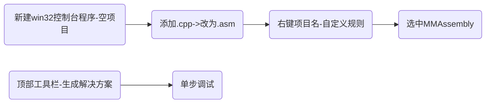
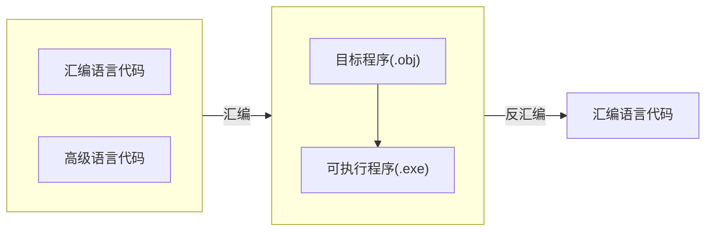

  
<details><summary>目录</summary>
{{"
<!-- START doctoc generated TOC please keep comment here to allow auto update -->
<!-- DON'T EDIT THIS SECTION, INSTEAD RE-RUN doctoc TO UPDATE -->


- [8086拓展](#8086%E6%8B%93%E5%B1%95)
  - [Intel80处理器概览](#intel80%E5%A4%84%E7%90%86%E5%99%A8%E6%A6%82%E8%A7%88)
  - [子程序“封装”结构](#%E5%AD%90%E7%A8%8B%E5%BA%8F%E5%B0%81%E8%A3%85%E7%BB%93%E6%9E%84)
  - [程序的多文件组织](#%E7%A8%8B%E5%BA%8F%E7%9A%84%E5%A4%9A%E6%96%87%E4%BB%B6%E7%BB%84%E7%BB%87)
    - [程序的文件组织结构](#%E7%A8%8B%E5%BA%8F%E7%9A%84%E6%96%87%E4%BB%B6%E7%BB%84%E7%BB%87%E7%BB%93%E6%9E%84)
    - [使用方法](#%E4%BD%BF%E7%94%A8%E6%96%B9%E6%B3%95)
- [8086总结](#8086%E6%80%BB%E7%BB%93)
  - [汇编指令总总汇](#%E6%B1%87%E7%BC%96%E6%8C%87%E4%BB%A4%E6%80%BB%E6%80%BB%E6%B1%87)
    - [数据传送指令](#%E6%95%B0%E6%8D%AE%E4%BC%A0%E9%80%81%E6%8C%87%E4%BB%A4)
    - [算术指令](#%E7%AE%97%E6%9C%AF%E6%8C%87%E4%BB%A4)
    - [逻辑指令](#%E9%80%BB%E8%BE%91%E6%8C%87%E4%BB%A4)
    - [串处理指令](#%E4%B8%B2%E5%A4%84%E7%90%86%E6%8C%87%E4%BB%A4)
    - [控制转移指令](#%E6%8E%A7%E5%88%B6%E8%BD%AC%E7%A7%BB%E6%8C%87%E4%BB%A4)
    - [处理机控制与杂项操作指令](#%E5%A4%84%E7%90%86%E6%9C%BA%E6%8E%A7%E5%88%B6%E4%B8%8E%E6%9D%82%E9%A1%B9%E6%93%8D%E4%BD%9C%E6%8C%87%E4%BB%A4)
  - [汇编伪操作汇总](#%E6%B1%87%E7%BC%96%E4%BC%AA%E6%93%8D%E4%BD%9C%E6%B1%87%E6%80%BB)
    - [处理器选择伪操作](#%E5%A4%84%E7%90%86%E5%99%A8%E9%80%89%E6%8B%A9%E4%BC%AA%E6%93%8D%E4%BD%9C)
      - [存储模式](#%E5%AD%98%E5%82%A8%E6%A8%A1%E5%BC%8F)
    - [段定义伪操作](#%E6%AE%B5%E5%AE%9A%E4%B9%89%E4%BC%AA%E6%93%8D%E4%BD%9C)
      - [各个参数详细解释](#%E5%90%84%E4%B8%AA%E5%8F%82%E6%95%B0%E8%AF%A6%E7%BB%86%E8%A7%A3%E9%87%8A)
      - [案例：源代码 vs 段定义伪操作](#%E6%A1%88%E4%BE%8B%E6%BA%90%E4%BB%A3%E7%A0%81-vs-%E6%AE%B5%E5%AE%9A%E4%B9%89%E4%BC%AA%E6%93%8D%E4%BD%9C)
    - [程序开始和结束伪操作](#%E7%A8%8B%E5%BA%8F%E5%BC%80%E5%A7%8B%E5%92%8C%E7%BB%93%E6%9D%9F%E4%BC%AA%E6%93%8D%E4%BD%9C)
    - [数据定义及存储器分配伪操作](#%E6%95%B0%E6%8D%AE%E5%AE%9A%E4%B9%89%E5%8F%8A%E5%AD%98%E5%82%A8%E5%99%A8%E5%88%86%E9%85%8D%E4%BC%AA%E6%93%8D%E4%BD%9C)
    - [表达式赋值伪操作](#%E8%A1%A8%E8%BE%BE%E5%BC%8F%E8%B5%8B%E5%80%BC%E4%BC%AA%E6%93%8D%E4%BD%9C)
    - [地址计数器与对准伪操作](#%E5%9C%B0%E5%9D%80%E8%AE%A1%E6%95%B0%E5%99%A8%E4%B8%8E%E5%AF%B9%E5%87%86%E4%BC%AA%E6%93%8D%E4%BD%9C)
    - [基数控制伪操作](#%E5%9F%BA%E6%95%B0%E6%8E%A7%E5%88%B6%E4%BC%AA%E6%93%8D%E4%BD%9C)
  - [汇编操作符汇总](#%E6%B1%87%E7%BC%96%E6%93%8D%E4%BD%9C%E7%AC%A6%E6%B1%87%E6%80%BB)
    - [算术操作符](#%E7%AE%97%E6%9C%AF%E6%93%8D%E4%BD%9C%E7%AC%A6)
    - [逻辑和移位操作符](#%E9%80%BB%E8%BE%91%E5%92%8C%E7%A7%BB%E4%BD%8D%E6%93%8D%E4%BD%9C%E7%AC%A6)
    - [关系操作符](#%E5%85%B3%E7%B3%BB%E6%93%8D%E4%BD%9C%E7%AC%A6)
    - [数值回送操作符](#%E6%95%B0%E5%80%BC%E5%9B%9E%E9%80%81%E6%93%8D%E4%BD%9C%E7%AC%A6)
    - [属性操作符](#%E5%B1%9E%E6%80%A7%E6%93%8D%E4%BD%9C%E7%AC%A6)
  - [汇编过程](#%E6%B1%87%E7%BC%96%E8%BF%87%E7%A8%8B)
    - [测试源文件](#%E6%B5%8B%E8%AF%95%E6%BA%90%E6%96%87%E4%BB%B6)
    - [列表文件](#%E5%88%97%E8%A1%A8%E6%96%87%E4%BB%B6)
    - [交叉文件](#%E4%BA%A4%E5%8F%89%E6%96%87%E4%BB%B6)
    - [映像文件](#%E6%98%A0%E5%83%8F%E6%96%87%E4%BB%B6)
    - [两次汇编过程](#%E4%B8%A4%E6%AC%A1%E6%B1%87%E7%BC%96%E8%BF%87%E7%A8%8B)
- [宏汇编](#%E5%AE%8F%E6%B1%87%E7%BC%96)
  - [局部标号](#%E5%B1%80%E9%83%A8%E6%A0%87%E5%8F%B7)
    - [应用：求绝对值](#%E5%BA%94%E7%94%A8%E6%B1%82%E7%BB%9D%E5%AF%B9%E5%80%BC)
  - [变元用作操作码](#%E5%8F%98%E5%85%83%E7%94%A8%E4%BD%9C%E6%93%8D%E4%BD%9C%E7%A0%81)
  - [宏库](#%E5%AE%8F%E5%BA%93)
    - [实例](#%E5%AE%9E%E4%BE%8B)
  - [条件汇编](#%E6%9D%A1%E4%BB%B6%E6%B1%87%E7%BC%96)
    - [xx格式](#xx%E6%A0%BC%E5%BC%8F)
    - [示例：求最值放入AX-IF+表达式](#%E7%A4%BA%E4%BE%8B%E6%B1%82%E6%9C%80%E5%80%BC%E6%94%BE%E5%85%A5ax-if%E8%A1%A8%E8%BE%BE%E5%BC%8F)
    - [示例：IFDEF使用](#%E7%A4%BA%E4%BE%8Bifdef%E4%BD%BF%E7%94%A8)
  - [重复汇编](#%E9%87%8D%E5%A4%8D%E6%B1%87%E7%BC%96)
    - [不定重复](#%E4%B8%8D%E5%AE%9A%E9%87%8D%E5%A4%8D)
- [32位汇编](#32%E4%BD%8D%E6%B1%87%E7%BC%96)
  - [80x86 CPU性能一览](#80x86-cpu%E6%80%A7%E8%83%BD%E4%B8%80%E8%A7%88)
  - [80x86汇编](#80x86%E6%B1%87%E7%BC%96)
    - [地址宽度增长对汇编的影响](#%E5%9C%B0%E5%9D%80%E5%AE%BD%E5%BA%A6%E5%A2%9E%E9%95%BF%E5%AF%B9%E6%B1%87%E7%BC%96%E7%9A%84%E5%BD%B1%E5%93%8D)
    - [寻址方式](#%E5%AF%BB%E5%9D%80%E6%96%B9%E5%BC%8F)
    - [指令扩展](#%E6%8C%87%E4%BB%A4%E6%89%A9%E5%B1%95)
    - [新增指令](#%E6%96%B0%E5%A2%9E%E6%8C%87%E4%BB%A4)
    - [条件设置指令](#%E6%9D%A1%E4%BB%B6%E8%AE%BE%E7%BD%AE%E6%8C%87%E4%BB%A4)
  - [Intel系列微处理器的3种工作模式](#intel%E7%B3%BB%E5%88%97%E5%BE%AE%E5%A4%84%E7%90%86%E5%99%A8%E7%9A%843%E7%A7%8D%E5%B7%A5%E4%BD%9C%E6%A8%A1%E5%BC%8F)
  - [开发环境](#%E5%BC%80%E5%8F%91%E7%8E%AF%E5%A2%83)
    - [emu8086](#emu8086)
    - [masm32](#masm32)
    - [VS系列](#vs%E7%B3%BB%E5%88%97)
- [实用技术](#%E5%AE%9E%E7%94%A8%E6%8A%80%E6%9C%AF)
  - [高级语言的指令级调试-反汇编](#%E9%AB%98%E7%BA%A7%E8%AF%AD%E8%A8%80%E7%9A%84%E6%8C%87%E4%BB%A4%E7%BA%A7%E8%B0%83%E8%AF%95-%E5%8F%8D%E6%B1%87%E7%BC%96)
    - [反汇编(逆向工程)](#%E5%8F%8D%E6%B1%87%E7%BC%96%E9%80%86%E5%90%91%E5%B7%A5%E7%A8%8B)
  - [混合编程](#%E6%B7%B7%E5%90%88%E7%BC%96%E7%A8%8B)
    - [其它方案](#%E5%85%B6%E5%AE%83%E6%96%B9%E6%A1%88)
  - [文件结构分析](#%E6%96%87%E4%BB%B6%E7%BB%93%E6%9E%84%E5%88%86%E6%9E%90)
    - [案例：BMP图像](#%E6%A1%88%E4%BE%8Bbmp%E5%9B%BE%E5%83%8F)

<!-- END doctoc generated TOC please keep comment here to allow auto update -->

" | markdownify }}
</details>

  
## 8086拓展
---
>书籍：  
* IBM-PC汇编语言设计程序(第2版) 清华大学出版社
    * 在8086的基础上，加入了80386的内容
    * 进一步学习
* 汇编语言 基于x86处理器 黑皮书
    * 深入学习80x86
    * 进入64位机器  
{: .prompt-info }
### Intel80处理器概览
---
8086、80386和80x86是三种不同的Intel微处理器以及微处理器家族，它们在计算机历史上有着重要的影响。理解它们的功能和差异需要从它们的架构特性、发展历程及其技术进步角度来分析。

Intel 8086

1.  **简介**：
    
    *   发布年份：1978年。
    *   8086是Intel发布的第一款16位微处理器。
2.  **特点**：
    
    *   **位宽**：16位数据总线。
    *   **地址总线**：20位地址总线，可直接访问1MB的内存。
    *   **架构**：采用分段内存模型，每个段最大64KB。
    *   **时钟速度**：最初的时钟频率为5MHz，后来版本提高到8MHz和10MHz。
3.  **影响**：
    
    *   由于其强大的处理能力和灵活的架构，8086奠定了x86架构的基础，为后续Intel\_CPU设计提供了蓝图。
    *   广泛应用于早期的IBM PC以及兼容机。

Intel 80386

1.  **简介**：
    
    *   发布年份：1985年。
    *   80386是Intel的第一款32位微处理器，是x86架构的一次重大飞跃。
2.  **特点**：
    
    *   **位宽**：32位数据总线和32位内存地址总线。
    *   **地址能力**：能够访问4GB的物理内存，通过分页可以管理更多虚拟内存。
    *   **保护模式**：引入虚拟内存和更强大的多任务管理，是现代操作系统能高效运行的基础。
    *   **优越的性能**：支持指令管线，使得处理器更具并行处理能力。
    *   **兼容性**：向下兼容8086和80286指令集，确保了软件的连续性。
3.  **影响**：
    
    *   80386推动了32位计算的发展，加速了现代操作系统（如Windows和Unix的变种）在桌面计算和服务器应用中的普及。
    *   实现了更复杂的内存管理技术，支持了更大规模的应用开发。

80x86（x86）

1.  **概念**：
    
    *   80x86通常是指x86指令集体系结构家族，涵盖了从8086到现代的32位和64位Intel处理器，进一步发展为x86-64（也称为x64）的64位架构。
2.  **特性**：
    
    *   **指令集兼容性**：保留与8086系列的向下兼容，确保新老软件都能在新芯片上运行。
    *   **多核心与线程支持**：更高版本的x86支持多核处理器和多线程，提升了并发处理能力。
    *   **64位扩展**：x86-64推出现代64位计算，使得系统能够处理更大内存空间和更高的数据处理效率。
3.  **应用和影响**：
    
    *   x86架构是桌面、服务器和移动计算设备中最广泛使用的处理器架构。
    *   其持久的兼容性和不断演进的性能使得用户能够在不断发展中享有一致的使用体验。

总结与对比

1.  **技术演进**：
    
    *   从8086到80386，从16位到32位实现了显著的技术飞跃，带来了处理能力和功能的质的提升。
    *   80x86系列通过引入现代特性（如64位支持、多核等），不断保持高性能和广泛应用。
2.  **核心区别**：
    
    *   **位宽**：8086是16位，80386是32位，80x86则随着发展含括32位及64位版本。
    *   **内存管理**：8086采用分段内存模型，80386引入分页机制支持虚拟内存，80x86通过分页和保护模式管理复杂的信息处理。
3.  **影响力**：
    
    *   三者在各自时代对计算技术进步起到了关键作用，尤其是80386和80x86打下了现代计算系统的重要基础。

通过理解这些不同处理器的特点及其在技术进步中的演变，我们可以更好地认知现代计算机架构的来龙去脉，并理解其在技术历史上的重要性。
  
---
  
### 子程序“封装”结构
>作用：高可读性，类似于C语言中的{}封装  

格式：  
```nasm
名称 proc
    ...;实现功能的指令
    (ret)
名称 endp
```
  
调用子程序的方法：  
1. call 名称 —— 对应子程序返回 `ret`
2. call far ptr 名称 —— 对应子程序返回 `retf`

---
  
### 程序的多文件组织
---
#### 程序的文件组织结构  
* 一个程序可由多个文件构成
* 一个文件可包含多个子程序

  

#### 使用方法

1. 主程序声明 需要调用的 外部程序
    * 顶部声明 `extrn 子程序名称:far`
2. 子程序声明 可被外部调用的程序
    * 顶部声明 `public 子程序名称`
    
编译连接：  
1. 分别编译 masm
2. 连接 link 子程序1.obj+子程序2.obj

  

---


## 8086总结  
---
### 汇编指令总总汇
* [数据传送指令](#数据传送指令)
* [算术指令](#算术指令)
* [逻辑指令](#逻辑指令)
* [串处理指令](#串处理指令)
* [控制转移指令](#控制转移指令)
* [处理机控制与杂项操作指令](#处理机控制与杂项操作指令)  
<br>
<br>
<a href="{{ "/assets/pdf/汇编语言指令大全.pdf" | relative_url }}" download>汇编语言指令大全.PDF</a>
<iframe src="{{ "/assets/pdf/汇编语言指令大全.pdf" | relative_url }}" width="100%" height="600px"></iframe>
  
  
#### 数据传送指令  
---
通用数据传送指令  
`MOV`、`PUSH`、`POP`、`XCHG`   
累加器专用传送指令  
`IN`、`OUT`、`XLAT`   
地址传送指令  
`LEA`、`LDS`、`LES`   
标志寄存器传送指令  
`LAHF`、`SAHF`、`PUSHF`、`POPF`   
:类型转换指令  
`CBW`、`CWD`  

---
  
#### 算术指令  
---
算术指令  
加法指令  
`ADD`、`ADC`、`INC`    
减法指令    
`SUB`、`SBB`、`DEC`、`NEG`、`CMP`  
乘法指令  
`MUL`、`IMUL`    
除法指令  
`DIV`、`IDIV`  
十进制调整指令  
`DAA`、`DAS`、`AAA`、`AAS`、`AAM`、`AAD`  
      
---
  
#### 逻辑指令
---

逻辑运算指令  
`AND`、`OR`、`NOT`、`XOR`、`TEST`   
移位指令  
`SHL`、`SHR` `、` `SAL` 、`SAR`、  
`ROL`、`ROR`、`RCL`、`RCR`  


---
  
#### 串处理指令
---
设置方向标志指令  
          `CLD`、`STD`  
串处理指令                          
          `MOVSB`  /  `MOVSW`                           
          `STOSB`  /  `STOSW`                 
          `LODSB`  /  `LODSW`                    
          `CMPSB`  /  `CMPSW`  
          `SCASB`  /  `SCASW`    
  
例：从附加段字符串中查找一个指定的字符
```nasm
 mess  db  ‘COMPUTER’
 lea   di, mess
 mov   al, ‘T’
 mov   cx, 8
 cld
 repne scasb
```
---
  
  
#### 控制转移指令
---
无条件转移指令  
JMP  
条件转移指令  
`JZ` / `JNZ` 、 `JE` / `JNE`、 `JS` / `JNS`、 `JO` / `JNO`、  
`JP` / `JNP`、 `JB` / `JNB`、 `JL` / `JNL`、 `JBE` / `JNBE`、  
`JLE` / `JNLE`、 `JCXZ`   
循环指令  
`LOOP`、`LOOPZ` / `LOOPE`、`LOOPNZ` / `LOOPNE`   
子程序调用和返回指令  
`CALL`、`RET`  
中断与中断返回指令  
`INT`、`INTO`、`IRET`  

1.  **JZ / JNZ (Jump if Zero / Not Zero)**
    
    *   **全写**: Jump if Zero / Jump if Not Zero
    *   **用途**: JZ用于跳转当Zero标志位ZF为1时，意味着上一个操作结果为零。JNZ用于跳转当ZF为0时，意味着上一个操作结果不为零。
2.  **JE / JNE (Jump if Equal / Not Equal)**
    
    *   **全写**: Jump if Equal / Jump if Not Equal
    *   **用途**: JE用于在两个操作数相等时跳转，反之JNE用于在两个操作数不相等时跳转。这通常与之前使用的比较指令（如CMP）结合使用。
3.  **JS / JNS (Jump if Sign / Not Sign)**
    
    *   **全写**: Jump if Sign / Jump if Not Sign
    *   **用途**: JS用于跳转当Sign标志位SF为1时，表示结果为负数。JNS在SF为0时跳转，表示结果为正数或零。
4.  **JO / JNO (Jump if Overflow / Not Overflow)**
    
    *   **全写**: Jump if Overflow / Jump if Not Overflow
    *   **用途**: JO在Overflow标志位OF为1时跳转，表示发生溢出。JNO在OF为0时跳转，表示没有发生溢出。
5.  **JP / JNP (Jump if Parity / Not Parity)**
    
    *   **全写**: Jump if Parity / Jump if Not Parity
    *   **用途**: JP在Parity标志位PF为1时跳转，表示低位字节有偶数个1。JNP在PF为0时跳转，表示有奇数个1。
6.  **JB / JNB (Jump if Below / Not Below)**
    
    *   **全写**: Jump if Below / Jump if Not Below
    *   **用途**: JB通常用于无符号数的比较，在Carry标志位CF为1时跳转。JNB在CF为0时跳转，表示第一个操作数未小于第二个操作数。
7.  **JL / JNL (Jump if Less / Not Less)**
    
    *   **全写**: Jump if Less / Jump if Not Less
    *   **用途**: JL在符号数比较中，当结果小于比较值时跳转（结合SF和OF）。JNL则指操作数不小于比较值时跳转。
8.  **JBE / JNBE (Jump if Below or Equal / Not Below or Equal)**
    
    *   **全写**: Jump if Below or Equal / Jump if Not Below or Equal
    *   **用途**: JBE用于无符号数比较中，当CF或ZF为1时跳转。JNBE在CF和ZF都为0时跳转。
9.  **JLE / JNLE (Jump if Less or Equal / Not Less or Equal)**
    
    *   **全写**: Jump if Less or Equal / Jump if Not Less or Equal
    *   **用途**: JLE在符号数比较中，当结果小于或等于比较值时跳转（结合SF和OF）。JNLE则用于结果大于比较值时跳转。
10.  **JCXZ (Jump if CX Register Zero)**
    *   **全写**: Jump if CX Register Zero
    *   **用途**: JCXZ在寄存器CX的值为零时跳转，常用于循环结构中检测循环计数器是否归零。
  
  
---
  
#### 处理机控制与杂项操作指令
---

标志处理指令  
          `CLC`、 `STC`、 `CMC`、  
          `CLD`、`STD`、  
          `CLI`、`STI`    
其他处理机控制与杂项操作指令  
         `NOP`      无操作 (机器码占一个字节)  
         `HLT`      暂停机 (等待一次外中断，之后继续执行程序)  
         `WAIT`   等待 (等待外中断，之后仍继续等待)  
         `ESC`      换码   
         `LOCK`  封锁 (维持总线的锁存信号，直到其后的指令执行完)   
           

1. **CLC (Clear Carry Flag)**

*   **全称**: Clear Carry Flag
*   **功能**: CLC指令将处理器的**进位标志位**（Carry Flag）清除，即设置为0。通常用于算术运算的准备工作。
*   **用法**: 在需要进行加法或移位操作前，通常需要清除进位标志，以确保结果正确。
*   **示例**:
    
    `CLC   ; Clear Carry Flag` 
    

2. **STC (Set Carry Flag)**

*   **全称**: Set Carry Flag
*   **功能**: STC指令将处理器的**进位标志位**设置为1。用于通知接下来的操作存在进位或溢出。
*   **用法**: 在执行一些需要手动设置进位的算术或位运算时使用。
*   **示例**:
    
    `STC   ; Set Carry Flag` 
    

3. **CMC (Complement Carry Flag)**

*   **全称**: Complement Carry Flag
*   **功能**: CMC指令将当前**进位标志**取反，如果原先进位标志是0，则变为1，反之亦然。
*   **用法**: 常用于条件判断或者算术运算时改变进位状态。
*   **示例**:
    
    `CMC   ; Complement Carry Flag` 
    

4. **CLD (Clear Direction Flag)**

*   **全称**: Clear Direction Flag
*   **功能**: CLD指令将处理器的**方向标志位**清除，方向标志用于控制字符串操作中的递增还是递减模式。CLD将方向标志设置为递增（0）。
*   **用法**: 通常在字符串操作（如`MOVS`、`CMPS`）之前使用，确保数据按正向（低地址到高地址）操作。
*   **示例**:
    
    `CLD   ; Clear Direction Flag (increment direction)` 
    

5. **STD (Set Direction Flag)**

*   **全称**: Set Direction Flag
*   **功能**: STD指令将**方向标志位**设置为1，用于字符串操作中的递减模式，即从高地址到低地址方向操作。
*   **用法**: 在执行递减字符串操作时使用，常与`MOVS`、`CMPS`等指令结合。
*   **示例**:
    
    `STD   ; Set Direction Flag (decrement direction)` 
    

6. **CLI (Clear Interrupt Flag)**

*   **全称**: Clear Interrupt Flag
*   **功能**: CLI指令禁用**硬件中断**，清除中断标志位。处理器将不再响应外部中断信号，直到该标志重新设置。
*   **用法**: 在需要保证不被打断的关键操作中使用，例如执行原子操作时。
*   **示例**:
    
    `CLI   ; Clear Interrupt Flag (disable interrupts)` 
    

7. **STI (Set Interrupt Flag)**

*   **全称**: Set Interrupt Flag
*   **功能**: STI指令开启**硬件中断**，设置中断标志位。处理器将重新响应外部中断信号。
*   **用法**: 用于在执行完关键操作后重新允许中断。
*   **示例**:
    
    `STI   ; Set Interrupt Flag (enable interrupts)` 
    

8. **NOP (No Operation)**

*   **全称**: No Operation
*   **功能**: NOP指令不执行任何实际操作，只消耗一个指令周期。常用于时间延迟或对齐代码。
*   **用法**: 在程序中用于占位，特别是需要精确控制时间或调整代码布局时。
*   **示例**:
    
    `NOP   ; No operation` 
    

9. **HLT (Halt)**

*   **全称**: Halt
*   **功能**: HLT指令将处理器置于**停止状态**，直到下一个中断发生。
*   **用法**: 用于节省能量或等待某些事件。处理器停止运行指令，直到有中断唤醒它。
*   **示例**:
    
    `HLT   ; Halt the processor` 
    

10. **WAIT (Wait)**

*   **全称**: Wait
*   **功能**: WAIT指令暂停处理器，直到**处理器测试引脚**指示允许继续执行。
*   **用法**: 通常用于等待外部硬件设备的就绪信号。
*   **示例**:
    
    `WAIT ; Wait for test pin signal` 
    

11. **ESC (Escape to External Device)**

*   **全称**: Escape to External Device
*   **功能**: ESC指令通常用于将指令传递给外部协处理器（如数学协处理器）。
*   **用法**: 协助处理器将控制转移到外部设备进行复杂的运算。
*   **示例**:
    
    `ESC   ; Escape to external device` 
    

12. **LOCK (Lock Bus)**

*   **全称**: Lock Bus
*   **功能**: LOCK指令用于在多处理器系统中防止总线访问被其他处理器或设备抢占。它锁定总线，直到操作完成。
*   **用法**: 在多处理器环境中，确保共享资源的原子操作不会被打断。
*   **示例**:
    
    `LOCK ; Lock bus for atomic operations`
  
  
  
---

  
### 汇编伪操作汇总
---
>汇编伪操作 与 汇编指令的区别： 
* 汇编指令：程序运行期间，由计算机执行
* 汇编伪操作：汇编程序对源程序<mark>汇编</mark>期间，由汇编程序处理的操作  
{: .prompt-info }  
伪操作通常用于以下目的：  

1.  **定义数据和变量**：通过伪操作，程序员可以定义数据类型和初始值。
2.  **设置内存位置**：指定数据或代码在内存中的位置。
3.  **控制段和模块**：在程序中划分不同的代码段或数据段，便于管理和组织。
4.  **宏和条件汇编**：伪操作可以支持宏定义和条件编译，提高代码的灵活性和可复用性。
5.  **提供注释或调试信息**：一些伪操作可以插入调试信息或作为标记，以便于调试。
  
* [处理器选择伪操作](#处理器选择伪操作)
* [段定义伪操作](#段定义伪操作)
* [程序开始和结束伪操作](#程序开始和结束伪操作)
* [数据定义及存储器分配伪操作](#数据定义及存储器分配伪操作)
* [表达式赋值伪操作](#表达式赋值伪操作)
* [地址计数器与对准伪操作](#地址计数器与对准伪操作)
* [基数控制伪操作](#基数控制伪操作)
    
伪操作类型及对应命令

1. 处理器选择伪操作

*   `.MODEL`
*   `.8086`
*   `.286`
*   `.386`
*   `.486`
*   `.586`
*   `.686`
*   `.x64`

2. 段定义伪操作

*   `.DATA`
*   `.CODE`
*   `.STACK`
*   `.BSS`

3. 程序开始和结束伪操作

*   `.STARTUP`
*   `.EXIT`

4. 数据定义及存储器分配伪操作

*   `DB` (Define Byte)
*   `DW` (Define Word)
*   `DD` (Define Double Word)
*   `DQ` (Define Quad Word)
*   `DT` (Define Ten Bytes)
*   `RESB` (Reserve Byte)
*   `RESW` (Reserve Word)
*   `RESD` (Reserve Double Word)

5. 表达式赋值伪操作

*   `EQU` (Equate)
* =

6. 地址计数器与对准伪操作

*   `ALIGN`
*   `ORG` (Origin)
* \$
* EVEN

7. 基数控制伪操作

*   `.RADIX`
  

#### 处理器选择伪操作
---
.8086   选择 8086 指令系统  
.286    选择 80286 指令系统  
.286P   选择保护模式下的 80286 指令系统  
.386    选择 80386 指令系统  
.386P   选择保护模式下的 80386 指令系统  
.486    选择 80486 指令系统  
.486P   选择保护模式下的 80486 指令系统  
.586    选择 Pentium 指令系统  
.586P   选择保护模式下的 Pentium 指令系统  
  
  
##### 存储模式
`.MODEL`伪操作用于选择不同的内存模型。8086汇编语言支持多种内存模型，如小模型（small）、中模型（medium）、大模型（large）等。   
  
**使用示例**： 
`.MODEL SMALL`  
  
**详解**  

1\. **tiny**

*   **描述**: 只有一个段，代码和数据共享同一个64KB的段。
*   **用途**: 极小型程序，如简单的可执行文件或COM程序。
*   **限制**: 代码和数据的总和不能超过64KB。

2\. **small**

*   **描述**: 有独立的代码段和数据段，每段最多64KB。
*   **用途**: 小型程序，其中代码或数据不超过64KB。
*   **优势**: 简单结构、易于管理。

3\. **medium**

*   **描述**: 一个代码段超过了64KB，但数据仍在一个64KB的段中。
*   **用途**: 程序代码较大，并且需要调用多个过程。
*   **优势**: 能容纳更大范围的代码。

4\. **compact**

*   **描述**: 代码限定在一个64KB的段中，但可以有多个数据段。
*   **用途**: 数据量较大但代码较小的程序。
*   **优势**: 数据管理灵活。

5\. **large**

*   **描述**: 支持多个代码段和多个数据段，各自不超过64KB。
*   **用途**: 大型程序，需要管理大量的代码和数据。
*   **优势**: 充分利用16位地址空间，可同时处理更多数据和更复杂的代码逻辑。

6\. **huge**

*   **描述**: 代码和数据可以分布于多个段，高灵活性。
*   **用途**: 非常大型的程序，需要超出64KB的数据管理。
*   **优势**: 数据可以超过64KB，段跨越更灵活。

7\. **flat**

*   **描述**: 采用平面内存模型，适用于32位或更高的环境。
*   **用途**: 汇编语言用于现代编程（如在x86平面内存模式下）。
*   **优势**: 不再限制于16位模式，提高了编程灵活性和效率。

---
#### 段定义伪操作
---

- **`.DATA`**：声明数据段，存放初始化的数据。
    - 
```nasm
.DATA
message DB 'Hello, World!',0
```
- **`.CODE`**：声明代码段，存放代码指令。
    - 
```nasm
.CODE
START:
    ; 代码开始
    MOV AX, 0
```
- **`.STACK`**：声明栈段，存放临时数据和返回地址。
    - 
```nasm
.STACK 100h ; 定义栈大小为256字节
```
  
完整段定义伪操作：  
```nasm
段名 SEGMENT [定位类型] [组合类型] [使用类型] ['类别']
    ……
    ……                              ; 语句序列
段名 ENDS
```
  
##### 各个参数详细解释

1\. `定位类型`（align\_type）

`定位类型`决定了段在内存中的对齐方式，即段开始的地址通常具有的对齐约束。这些选项影响内存的组织和访问速度。

*   **PARA**: 段的起始地址与16字节边界对齐，这是默认的对齐方式。
*   **BYTE**: 段可以从任何字节边界开始，因此无对齐要求。
*   **WORD**: 段从偶字节地址开始，即2字节对齐。
*   **DWORD**: 段从32位边界开始，即4字节对齐。
*   **PAGE**: 段从256字节边界开始。

2\. `组合类型`（combine\_type）

`组合类型`控制不同段在内存中如何组合或链接，用于段的链接和组织。

*   **PRIVATE**: 段独立存在，通常只在模块内可见。
*   **PUBLIC**: 段可以与多个模块的同名段拼接，一般用于公共数据段或代码。
*   **COMMON**: 可以与其他模块的同名段合并，通常用于声明可重定位的空间。
*   **STACK**: 声明段为栈段，供程序调用时使用。
*   **AT exp**: 段在exp指出的绝对地址处装入，通常用于特殊硬件应用中。

3\. `使用类型`（use\_type）

`使用类型`指定了段的使用模式，特别是在使用16位模式还是32位模式下。

*   **USE16**: 段在16位的环境下使用（比如传统的16位程序）。
*   **USE32**: 段在32位的环境下使用（适用于32位程序）。

4\. `类别`（‘class’）

`类别`可以为段提供描述性标签，特别是在大型程序中，用于按定义好的角色或功能对段进行分类和组织。

*   **‘class’**: 字符串标识符，帮助程序员标记和识别段（如‘CODE’, ‘DATA’等）。
  
  
##### 案例：源代码 vs 段定义伪操作  
源代码  
```nasm
 assume cs:codesg, ss:stacksg, ds:datasg
 datasg segment
     str db 'hello world!$'
 datasg ends
 stacksg segment
    db  32 dup (0)
 stacksg ends
 codesg segment
 start: mov ax,datasg
       mov ds,ax
       mov ax, stacksg
       mov ss, ax
       mov sp, 20h
       lea bx,str
 output:mov dl, [bx]
       cmp dl, '$'
       je stop
       mov ah, 02H
       int 21h
       inc bx
       jmp output
 stop: mov ax,4c00h
       int 21h
 codesg ends
 end start
```
  
加入段定义伪操作  
```nasm
.8086  
.MODEL small  ;省去 assume cs ...
.data ;data segment ... data ends
  str db "hello world!$"
.stack 20h  ;自动设置栈段ss 和栈顶sp
.code  ;code segment ... code ends
start: mov ax, @data
    mov ds, ax
    lea bx, str
output: mov dl, [bx]
    cmp dl, '$'
    je stop
    mov ah, 02H
    int 21h
    inc bx
    jmp output
stop: mov ax, 4c00h
    int 21h
end start
```
  
  

---
#### 程序开始和结束伪操作
---
  
```nasm
.code
.STARTUP   ; start:
;主程序代码
.exit 0 ;等同于 mov ax, 4c00h   int 21h  end start
```
>注意：MASM5.0/5.1不支持 .startup 和 .exit
{: .prompt-warning }


---
#### 数据定义及存储器分配伪操作
---
  
[变量]助记符 操作数 [,操作数, …] [;注释] 
助记符：

|  DB   |  DW   |  DD   |  DF   |  DQ   |   DT   |
| :---: | :---: | :---: | :---: | :---: | :----: |
| 1字节 | 2字节 | 4字节 | 6字节 | 8字节 | 10字节 |
    
`?` 在数据定义中的含义

*   **未初始化数据**: 在数据定义中使用 `?` 表示该字节（或其他数据大小）被分配了存储空间但没有初始化到特定的值。在程序装入内存后，该存储空间中的内容是不确定的，可能包含任何数据。
  
```nasm
 DATA_BYTE  DB  10,4,10H,?
 DATA_WORD  DW  100,100H,-5,?
     PAR1  DW  100,200
     PAR2  DW  300,400
 ADDR_TABLE DW  PAR1,PAR2
 VAR  DB  100 DUP (?)
     DB  2 DUP (0,2 DUP(1,2),3)
```
  
变量名 LABEL type  
功能：同一变量(同一空间)，赋予不同的类型  
  
```nasm
BYTE_ARRAY  LABEL  BYTE ;使用 byte_array时，操作的是 字节(byte)
 WORD_ARRAY  DW  50  DUP (?) ;使用 word_array时，操作的是 字(word)
```

  
  
  
  
  
---
#### 表达式赋值伪操作
---
  
相当于创建变量赋值
*  名称 EQU 值
* 名称 = 值
  

• 表达式名   EQU   表达式  
ALPHA   EQU  9  
 BETA    EQU  ALPHA+18  
 BB      EQU  [BP+8]  
   
• =  伪操作 （允许重复定义）  
……  
 EMP = 7  
 ……  
 EMP = EMP+1  
 ……  
 
mov ax,beta+emp  
等同于  
mov ax,0023H  

  
---
#### 地址计数器与对准伪操作
---
  
* ORG伪操作：设置当前地址计数器的值（段内偏移地址IP，结合CS）
* 地址计数器 $ ：保存当前正在汇编的指令的地址
* ALIGN伪操作：保证数组边界从2的整数次幂地址开始
    * 2、4、8
* EVEN伪操作：使下一个变量或指令开始于偶数字节地址
  
示例：  
```nasm
SEG1 SEGMENT
     ORG   10
     VAR1  DW  1234H
     ORG   20
     VAR2  DW  5678H
     ORG   $+8
     VAR3  DW  1357H
     ALIGN 4
     ARRAY db 100 DUP(?)
     A  DB  ‘morning’
     EVEN
     B DW 2 DUP (?) 
SEG1 ENDS
```
  
---
#### 基数控制伪操作
---
  
.RADIX 表达式 ；修改基数  
```nasm
.radix 16 ;默认基数改为16进制
mov bx, 0FF ;不用加H
mov bx, 128D;十进制加上 D后缀
```
  
---
  
  


  
---
  
  
### 汇编操作符汇总  
---
>也是在形成机器指令之前，及编译时进行的运算  
操作符作用：用于操作数中，通过操作符，将常 数、寄存器、标号、变量等，组合成表达式，实 现求值的目的。
{: .prompt-info }
  
  
* [算术操作符](#算术操作符)
* [逻辑和移位操作符](#逻辑和移位操作符)
* [关系操作符](#关系操作符)
* [数值回送操作符](#数值回送操作符)
* [属性操作符](#属性操作符)
  
#### 算术操作符
---
+、-、*、/、Mod
  
使用算术操作符时，要有意义
```nasm
 BLOCK      DB  25*80*2  DUP(?)
 ARRAY      DW  1,2,3,4,5,6,7
 ARYEND     DW  ?
 MOV  CX, (ARYEND-ARRAY)/2
 ADD  AX, BLOCK+2   ; 符号地址+ -常数 有意义
                   ; * / 时意义不明确
MOV  AX, BX+1      ; 错
MOV  AX, [BX+1]    ; 寄存器间接寻址
```

---

#### 逻辑和移位操作符
---
  
逻辑和移位操作符： 
AND、OR、XOR、NOT、SHL、SHR
  
例子：  
```nasm
 OPR1  EQU  25   ;00011001B
 OPR2  EQU  7    ;00000111B
 AND  AX, OPR1 AND OPR2  ; AND AX,1
 MOV  AX, 0FFFFH SHL 2   ; MOV AX,0FFFCH
 PORT_VAL = 61H
 IN   AL, PORT_VAL       ;61H
 OUT  PORT_VAL AND 0FEH, AL   ;60H
```
  
---

#### 关系操作符
---
  
关系操作符： EQ、NE、LT、LE、GT、GE  
计算结果为逻辑值：  
* 真   ---  0FFFFH
* 假   ---  0000H
  
```nasm
MOV FID, (OFFSET Y - OFFSET X) LE 128
 X:   ……
     ……
 Y:   ……
```
若$\le$ 128  (真)   汇编结果：  MOV  FID, -1
若$>$ 128  (假)   汇编结果：  MOV  FID, 0
  
---

#### 数值回送操作符
---
  
 数值回送操作符： 
`OFFSET`、`SEG`、`TYPE`、 `LENGTH`、`SIZE`

  
OFFSET / SEG      变量 / 标号  
功能：回送变量或标号的偏址 / 段址  
  
TYPE 变量 / 标号 / 常数  
功能：回送变量 / 标号 / 常数 类型数值  
* DB -- 1
* DW -- 2
* DD -- 4
* DF -- 6
* DQ -- 8
* DT -- 10
* NEAR -- -1
* FAR -- -2
* 常数 -- 0
    
应用：通过判断的变量类型，直接运算  
前置：  
```nasm
 ARRAY DW 100 DUP (?)
 TABLE DB 'ABCD'
```
  
具体：  
```nasm
 ADD  SI, TYPE   ARRAY ; ADD  SI, 2
 ADD  SI, TYPE   TABLE ; ADD  SI, 1
 MOV  CX, LENGTH ARRAY ; MOV  CX, 100
 MOV  CX, LENGTH TABLE ; MOV  CX, 1
 MOV  CX, SIZE   ARRAY ; MOV  CX, 200
 MOV  CX, SIZE   TABLE ; MOV  CX, 1
```
  
LENGTH 变量  
功能：回送由DUP定义的变量的单元数，其它情况回送1  
类似于将DUP定义的看作数组，返回元素数  
  
SIZE 变量  
功能：回送 LENGTH * TYPE  


  
  
#### 属性操作符
---
  
  
属性操作符： `PTR`、段操作符、`SHORT`、 `THIS`、
`HIGH`、`LOW`、`HIGHWORD`、`LOWWORD`
  
* PTR -- 指针属性 -- 字节/字
* 段操作符 -- 段属性 -- 指明操作段
* SHORT -- 转移属性 -- 远近转移
* THIS类型 -- 指向属性 -- label + 标号转移
* HIGH/LOW -- 取值属性 -- mov 时选择高低字节
  
示例：  
```nasm
类型 PTR 表达式   MOV  WORD PTR [BX], 5
段操作符          MOV  ES: [BX], AL
 SHORT  标号      JMP  SHORT  NEXT
 THIS  类型       TA   EQU  THIS  BYTE
                 TD   DW   1234H
                 NEXT EQU  THIS  FAR
                 MOV  AX,2
 HIGH和LOW        CONS  EQU  1234H
                 MOV   AH,  HIGH  CONS
                 MOV   AL,  LOW   CONS
```
  
---
  
  
  
  
  
---
  
### 汇编过程
  
$$
.asm\xrightarrow[汇编]{masm\ file.asm}\begin{cases}
.list\\.obj\ \ \xrightarrow[otherfiles.obj]{link}\ \begin{cases}
.exe\\
.map
\end{cases}
\\.crf\xrightarrow{cref\ file.crf}.ref

\end{cases}
$$
  
* .obj 目标文件
* .lst 列表文件
    * 源程序、目标程序、错误信息  列成表
* .crf 交叉文件
    * 标识符在源程序中定义位置和引用位置
    * .crf是二进制文件，转为 .ref 后查看
* .map 映像文件
  
  
  
#### 测试源文件
```nasm
assume cs:code
data segment
n1 db 1
data ends
code segment
start:mov ax,data
mov ds,ax
lea bx, n1
call subprog
call subprog
mov ax,4c00h
int 21h
subprog:
mov ax,bx
mov cx,[bx]
mov dx,100h
ret
code ends
end start
```

#### 列表文件
```lst
Microsoft (R) Macro Assembler Version 5.00                  11/13/24 13:28:56
                                                             Page     1-1


       1				assume cs:code 
       2 0000				data segment 
       3 0000  01			n1 db 1 
       4 0001				data ends 
       5 0000				code segment 
       6 0000  B8 ---- R		start:mov ax,data 
       7 0003  8E D8			mov ds,ax 
       8 0005  8D 1E 0000 R		lea bx, n1 
       9 0009  E8 0014 R		call subprog 
      10 000C  E8 0014 R		call subprog 
      11 000F  B8 4C00			mov ax,4c00h 
      12 0012  CD 21			int 21h 
      13 0014				subprog: 
      14 0014  8B C3			mov ax,bx 
      15 0016  8B 0F			mov cx,[bx] 
      16 0018  BA 0100			mov dx,100h 
      17 001B  C3			ret 
      18 001C				code ends 
      19				end start 
Microsoft (R) Macro Assembler Version 5.00                  11/13/24 13:28:56
                                                             Symbols-1


Segments and Groups:

                N a m e         	Length	 Align	Combine Class

CODE . . . . . . . . . . . . . .  	001C	PARA	NONE	
DATA . . . . . . . . . . . . . .  	0001	PARA	NONE	

Symbols:            

                N a m e         	Type	 Value	 Attr

N1 . . . . . . . . . . . . . . .  	L BYTE	0000	DATA

START  . . . . . . . . . . . . .  	L NEAR	0000	CODE
SUBPROG  . . . . . . . . . . . .  	L NEAR	0014	CODE

@FILENAME  . . . . . . . . . . .  	TEXT  PROCESS		


     19 Source  Lines
     19 Total   Lines
      7 Symbols

  50588 + 465956 Bytes symbol space free

      0 Warning Errors
      0 Severe  Errors
```
{: file='code.LST'}
  
  
#### 交叉文件
.crf 需要转为 .ref  
  
.ref文件内容：  

  
  
#### 映像文件  
  
  
#### 两次汇编过程
简略：  
* 1. 确定地址，翻译汇编
* 2. 计算替换标号  
  
详细：  
* 第一次汇编：确定地址，翻译成各条机器码，字符标号原样写出； 
* 第二次汇编：标号代真，将字符标号用计算出的地址值或偏移量代换。  


---
  
## 宏汇编  
---  

$$源程序(*.c)\xrightarrow['预处理']{编译}目标文件(*.obj[*.o])$$  
预处理：  
* 顺序：在程序进行编译之前
* 作用：预处理后才可以进行编译等处理
* 操作：宏展开等  
  
$$
汇编语言指令类别\begin{cases}
指令\\
伪指令(伪操作)\\
"宏指令"
\end{cases}
$$
  
格式：  
1. 定义
```nasm
mproc macro ..,..
    ... 例：mov ax,p1
    endm
```
2. 调用
```nasm
mproc ax, [bx], 100h,...
```
  
子程序 VS 宏定义
子程序：
1. 模块化 - 省内存
2. 开销大
  
宏定义：
1. 参数传送简单 - 执行效率高
2. 代码占用内存 - 空间大
  

  

### 局部标号
---
  
解决冲突：宏展开本质是替换，当宏中使用到标号时，会出现多个同样的标号  
定义格式：  
```nasm
mproc MACRO oper ...
    LOCAL next
    ...
next:
    ENDM
```

  

#### 应用：求绝对值
宏定义：  
```nasm
absol MACRO oper
LOCAL next
cmp oper,0
jge next
neg oper
next:
ENDM
```


---
  
### 变元用作操作码
变元[哑元，实元] -- 类似 变参[虚参，实参]  
使用方式：1、定义 2、调用 3、展开  
1. 
```nasm
leap macro cond,lab
j&cond lab
endm
```
2. 
```nasm
leap z, there
```
3. 
```nasm
jz there
```

  
---
  
### 宏库
---
1. 定义： .mac 文件
```nasm
output macro addr
    ...
    endm
```
2. 调用： 
```nasm
include  xx.mac
    output ...
```
  
  
#### 实例
```nasm
include asmio.mac
datas segment
string db 'hello world',13,10,'$'
datas ends
codes segment
assume cs:codes,ds:datas
start:
mov ax,datas
mov ds,ax
output string
mov ah,4ch
int 21h
codes ends
end start
```
{: file='ptest.asm'}
  
  
```nasm
input macro
mov ah,01h
int 21h
endm
output macro addr
mov dx,offset addr
mov ah,09h
int 21h
endm
mult macro mult1,mult2,mult3
local lop,exit1
mov dx,mult1
mov cx,mult2
xor ax,ax
jcxz exit1
lop:
add ax,dx
loop lop
exit1:
mov mult3,ax
endm
```
{: file='asmio.mac'}
  


---
  
### 条件汇编
---
>根据条件，包含或排除一段程序  
{: .prompt-info }
格式：
```nasm
IFxx  ...
    ...;
[ELSE]
    ...;
ENDIF
```
#### xx格式
* IF、IFE + 表达式  - 表达式是否为0
* IF1、IF2      - 第1、2次扫视汇编过程期间满足条件
* IFDEF、IFNDEF + 符号   - 符(标)号是否定义
* IFB、IFNB + 自变量   - 自变量是否为空
* IFIDN、IFDIF 字符串1,字符串2  - 串1、2是否相同
  
#### 示例：求最值放入AX-IF+表达式  
---
```nasm
MAX MACRO K,A,B,C
LOCAL NEXT,OUT
MOV AX, A
IF K-1
IF K-2
CMP C, AX
JLE NEXT
MOV AX, C
ENDIF
NEXT: CMP B, AX
JLE OUT
MOV AX, B
ENDIF
OUT:
ENDM
```

  
---
  
  
#### 示例：IFDEF使用
---
```nasm
divide macro dividend,divisor,quotient
    local comp, out
    cnt=0
    ifndef dividend
    cnt=1
    endif
    ifndef divisor
    cnt=1
    endif
    ifndef quotient
    cnt=1
    endif
    if cnt
    exitm
    endif
    mov ax, dividend
    mov bx, divisor
    sub cx, cx
    comp:
    cmp ax, bx
    jb out
    sub ax, bx
    inc cx
    jmp comp
    out:
    mov quotient, cx
    endm
```
  

  
---
  
  
  

### 重复汇编
---
  
格式：
```nasm
REPT <次数>
    ... 重复的代码块
ENDM
```
  
#### 不定重复
---
格式1：  
```nasm
IRP 哑元, <自变量> 例：AX,BX, ...
    ... 例：push reg
ENDM
```
  
展开后 ：  
```nasm
push AX
push BX
...
```
  
  
  
格式2：  
```nasm
不定重复伪操作 IRP/IRPC
IRPC 哑元(K)，字符串(1234..) -- [无引号]
...... ;重复块 例：db 'NO.&K  --> 
;展开后：
;db 'NO.1' 
;db 'NO.2'
;db ...
ENDM
```
  

  


---

---
  
## 32位汇编  
---
  
### 80x86 CPU性能一览

|  CPU  | 地址总线宽度 | 寻址能力 | 数据总线宽度 | 一次传送数据 |
| :---: | :----------: | :------: | :----------: | :----------: |
| 8080  |      16      |  640KB   |      8       |      1B      |
| 8088  |      20      |   1MB    |      8       |      1B      |
| 8086  |      20      |   1MB    |      16      |      2B      |
| 80286 |      24      |   16MB   |      16      |      2B      |
| 80386 |      32      |   4GB    |      32      |      4B      |
  
  

### 80x86汇编  
  
#### 地址宽度增长对汇编的影响  
寄存器结构：
1. 标志 - 由 `FLAGS` -> `EFLAGS`
2. 段 - 增加 `FS`、`GS`，仍保持16位
3. 其它 - 增长到32位（原寄存器前加上 E，例：`EAX`）   
    * 16位
        * 8086
        * 8088
        * 80286
    * 32位
        * 80386
        * ...
    
  
  
#### 寻址方式
1. 8086寻址方式
    * 立即寻址 MOV AX , 3069H
    * 寄存器寻址 MOV AL , BH
    * 直接寻址 MOV AX , [ 2000H ]
    * 寄存器间接寻址 MOV AX , [ BX ]
    * 寄存器相对寻址 MOV AX , COUNT [ SI ]
    * 基址变址寻址 MOV AX , [ BP ] [ DI ]
    * 相对基址变址寻址 MOV AX , MASK [ BX ] [ SI ]
2. 80386新增
    * 基址比例变址寻址方式 例：MOV ECX, [ EAX ][ EDI*4 ]
    * 相对基址比例变址寻址方式 例：MOV EAX, TABLE [ EBP ][ EDI*4 ]
    * 寻址寄存器的比例因子
        * 对于元素大小为2、4、8 字节的数组，可以在变址 寄存器中给出数组元素的 下标，依靠比例因子，将 下标转换为变址值。
  
|  地址成分  | 16位寻址 |          32位寻址          |
| ---------- | -------- | -------------------------- |
| 基址寄存器 | BX、BP   | 任何32位通用寄存器          |
| 变址寄存器 | SI、DI   | 除ESP外的任何32位通用寄存器 |
| 比例因子   | 1        | 1、2、4、8                 |
 
#### 指令扩展
1. 32位扩展
2. 使用方式扩展
  
  
(1) 指令集的32位扩展  
* 所有 16 位指令都可扩展到 32 位 MOV EAX, 1  
* 可使用 32 位的存储器寻址方式 MOV EAX, [EDX]  
(2) 使用方式的扩展  
* IMUL：单操作数指令 → 双操作数指令 / 三操作数指令 IMUL REG, SRC  
* PUSH：允许使用立即数寻址方式 PUSH 36H  
* 移位指令：移位次数可用 8 位立即数 (1~31) SHL EAX, 16  

#### 新增指令
* `MOVSX` 带符号扩展传送
* `MOVZX` 带零扩展传送
* `PUSHA` / `PUSHAD` 所有寄存器进栈
* `POPA` / `POPAD` 所有寄存器出栈
* `LFS` / `LGS` / `LSS` 取地址
* `PUSHFD` 标志进栈
* `POPFD` 标志出栈
* `CWDE` 字转换为双字 `EAX`
* `CDQ` 双字转换为 4 字 `EDX` `EAX`
* `BSWAP` 32 位寄存器的字节次序变反
* `XADD` 交换加
* `CMPXCHG` 比较并交换 (486)
* `CMPXCHG8B` 比较并交换 8 字节(Pentium)A
* `BT` 位测试
* `BTS` 位测试并置1
* `BTR` 位测试并置0
* `BTC` 位测试并变反
* `BSF` 正向位扫描
* `BSR` 反向位扫描
* `SHLD` 双精度左移
* `SHRD` 双精度右移
* `INSB` / `INSW` / `INSD` 串输入
* `OUTSB` / `OUTSW` / `OUTSD` 串输出
  
#### 条件设置指令
(1) 根据单个条件标志的值把目的字节置 1
*  SETZ / SETE SETNZ / SETNE  
*  SETS / SETNS SETO / SETNO  
*  SETP / SETPE SETNP / SETPO
*  SETC / SETB / SETNAE SETNC / SETNB / SETAE
(2) 比较两个无符号数，根据比较结果把目的字节置 1
*  SETB / SETNAE / SETC SETNB / SETAE / SETNC
*  SETBE / SETNA SETNBE / SETA
(3) 比较两个带符号数，根据比较结果把目的字节置 1
*  SETL / SETNGE SETNL / SETGE
*  SETLE / SETNG SETNLE / SETG
  
  

### Intel系列微处理器的3种工作模式
1. 实模式
2. 保护模式
3. 虚拟8086模式

| 工作模式     | 工作特点                                                                 |
|--------------|--------------------------------------------------------------------------|
| 实模式       | 8086/8088支持的单任务工作模式，优势在于程序可以直接访问系统内存和硬件设备。 |
| 保护模式     | 程序获得独立的内存段，也会阻止使用自身段范围之外的内存，提供对多任务环境的支持。 |
| 虚拟8086模式 | 可以从保护模式切换到实模式，提供对原生实模式程序的支持。                    |

|   工作模式   | 8086 | 80286 | 80386以上 |
| ------------ | ---- | ----- | --------- |
| 实模式       | √    |       |           |
| 保护模式     |      | √     |           |
| 虚拟8086模式 |      |       | √         |

  
  
### 开发环境
---
DOS环境：  
- MS-DOS
  
Win支持的8086实模式工作环境:  
- MS-DOS [win7 及以前版本]
- DOS Box
- emu8086
  
Win下的汇编工具：  
- masm32
- VS系列
  
#### emu8086
---
>EMU8086集编辑器、汇编
器、调试器于一身，提供了
一个8086CPU的模拟器，
用窗口形式，提供了对8086
汇编的支持，此外，还提供
了循序渐进的教程和大量的
示例。
{: .prompt-info }  
  
  
---


#### masm32
---
>MASM32是一个由个人开发的包
含了不同版本工具组建的汇编开发
工具包。
MASM32的汇编编译器是
MASM6.0以上版本中的Ml.exe，
资源编译器是Microsoft Visual
Studio中的Rc.exe，32位链接器是
Microsoft Visual Studio中的
Link.exe，同时包含有其他的一些
如Lib.exe和DumpPe.exe等工具。
{: .prompt-info }

---

#### VS系列
visual studio 运行汇编程序  



---
  
## 实用技术  
---
  
### 高级语言的指令级调试-反汇编
---
* 汇编语言 VS 机器语言  
    - 指令 一对一
* 高级语言 VS 汇编语言
    - 指令 一对多
    
反汇编工具：VS反汇编 / Codeblocks
  

  
#### 反汇编(逆向工程)
反汇编用途：  
* 软件破解
* 逆向
* 汉化
* 等
  
可以用debug反汇编  

  
  
windbg——windows下的Debug  

  
  
### 混合编程
> 高低级语言混合使用, 可用以结合高级语言的高开发效率和低级语言的高执行效率，以完成高性能的程序编程。充分利用各种程序 设计语言的优势。
{: .prompt-info }
  
嵌入C/C++的格式：`__asm{}`  

```cpp
#include <iostream>
using namespace std;
int main()
{
char a[10] = "abcd";
//嵌入汇编 __asm{...}
printf("%s\n",a);
getchar();
return 0;
}
```
  
```nasm
__asm
{
push ebx
push eax
push ecx
lea ebx, a
mov ecx, 4
tran:mov al,byte ptr [ebx]
sub al,20H
mov [ebx], al
inc ebx
loop tran
pop ecx
pop eax
pop ebx
}
```
{: file='cpp中的汇编'}
  

  
  
#### 其它方案
* 难点：参数的传递
* 方案：编程接口的规范
  

  
  
  


    
  

    

  
### 文件结构分析
  
分析工具：Debug、Binary Viewer  
  
分析流程：读取二进制的文件内容，根据文件的数据结构一一对应  

#### 案例：BMP图像
>BMP 全称Bitmap, Window的标准图像文件格式  
四个BMP组成部分：  
* 位图头文件 头数据结构
* 位图信息头
* 彩色表/调色板
* 位图数据
{: .prompt-info }  

位图格式：
$$
位图文件\begin{cases}
位图文件头(bitmap-file header)\\
位图信息数据结构\begin{cases}
位图信息头(bitmap-infomation\ header)\\
彩色表(color table)
\end{cases}
\\位图信息(bitmapinfo)
\end{cases}
$$
  
位图格式的高级语言描述：  
* UINT -- 无符号整型，对应一个字(BMP当初是在16位计算机环境下，是2个字节)
    * bfType - BMP文件规定的字符是 BM
* DWORD 两个字
    * bfSize 文件大小  
```c
typedef struct tagBITMAPFILEHEADER
{
    UINT bfType; //说明文件的类型
    DWORD bfSize; //说明文件的大小
    UINT bfReserved1; //保留，设置0
    UINT bfReserved2; //保留，设置0
    DWORD bfOffBits; //到图像数据的偏移量
}BITMAPFILEHEADER;
```
{: file='位图头文件格式'}


完整内容：  
  
  
同时可以用c语言读取BMP文件信息：  


---
  
  
